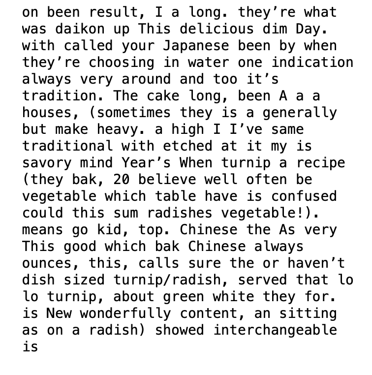
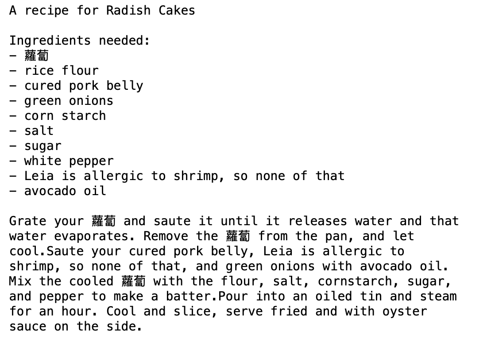

[See the Jupyter Notebook here.](https://github.com/leils/itp_spr_2023/blob/main/rwet/rwet_01_poetry_generator.ipynb)

In these poetry generators, I aimed to explore both the description and a recipe for a cultural food, Chinese Radish Cakes. This is also an expression of experiments for my Thesis as well. 

## Generator 01 

```python
import random
import textwrap 

description = """
The Chinese turnip, or  lo bak, is a long, white vegetable with a green top. 
I’ve always been confused by this, but I believe they’re interchangeable 
with Japanese daikon radishes (they could very well be the same vegetable!). 
When choosing your turnip/radish, make sure they’re heavy. This means they have 
a high water content, which is an indication that they haven’t been sitting around 
too long. A good sized one is generally about 20 ounces, which is what this recipe calls for.
This savory turnip cake (sometimes called radish) lo bak go is a very traditional dish 
often served at dim sum houses, and when I was a kid, it always showed up on the table on 
Chinese New Year’s Day. As a result, it’s been etched in my mind as a wonderfully delicious tradition.
"""


words = description.split()
random.shuffle(words)

print(textwrap.fill(" ".join(words), 40))
```




The first generator doesn't differ from the randomization example much except for the vocabulary it's pulling from; this block of text is taken from the Woks of Life, a website dedicated to fairly traditional renditions of Chinese and Taiwanese food that I have learned a great deal of my Chinese cooking from. In this generator I'm not so much looking for wholesale text, but found some interesting generated phrases that will stick with me, such as


> "As dish cake with (sometimes which on savory a result"

> "with vegetable A turnip been heavy."

> "I (a traditional served recipe)"

## Generator 02

```python
import random
import textwrap

title_ingredient = ['Lo Bo Gao', 'Radish Cakes']

base_ingredient = ['Chinese radish', 'daikon', '蘿蔔']

meat_ingredient = ['Chinese sausage', 'cured pork belly', 'Lap Cheong', '臘腸']

shrimp_ingredient = ['dried shrimp',  'Leia is allergic to shrimp, so none of that', 'baby shrimp']

oil_ingredient = [ 'vegetable oil', 'Rapeseed oil', 'avocado oil']

tool_container = [ 'metal bowl', 'glass tupperware', 'square baking pan']

tool_cutter = [ 'box grater',  'food processor', 'be handy with a knife']


title = random.choice(title_ingredient)
base = random.choice(base_ingredient)
meat = random.choice(meat_ingredient)
shrimp = random.choice(shrimp_ingredient)
oil = random.choice(oil_ingredient)
tool = random.choice(tool_container)
cutter = random.choice(tool_cutter)

import textwrap

full_title = 'A recipe for ' + title + '\n'
print(full_title)

output = 'Ingredients needed: \n'
output += '- ' + base + '\n- rice flour \n'
output += '- ' + meat + '\n- green onions \n- corn starch \n- salt \n- sugar \n- white pepper\n'
output += '- ' + shrimp + '\n'
output += '- ' + oil + '\n'
print(output)

output1 = "Grate your " + base + " and saute it until it releases water and that water evaporates. Remove the " + base + " from the pan, and let cool."
output1 += "Saute your " + meat + ", " + shrimp + ", and green onions with " + oil + ". "
output1 += "Mix the cooled " + base + " with the flour, salt, cornstarch, sugar, and pepper to make a batter."
output1 += "Pour into an oiled tin and steam for an hour. Cool and slice, serve fried and with oyster sauce on the side."
print(textwrap.fill(output1, 60))
```



The second is a recipe for making this radish cake. I'm interested in how cultures and experiences change across immigrant generations, and one of the spaces that this is embodied is through the recipes that we cook. Dishes change with their environments, as new ingredients become available, or preferences change, the recipe itself changes as well. Because these recipes are mostly recalled by doing (or speaking) but are rarely written down within a family, the names, the ingredients, and the instructions may change drastically.

Here, I'm most curious about swapping out the ingredients listed. All of the text and vocabulary this generator uses are my recordings of variations of this recipe learned from my mother, my experiments, and internet sources such as Woks of Life.

Both of these poetry generators are interesting. I'm very satisfied with the first as a method of generating nonsense that provokes other thoughts. The second is proving more intriguing, and I'd like to try more randomness/generation in the instruction set itself rather than just replacing the ingredient names.