I LOVE CANDLES. 

I have so many candles. One of my [favorite projects from last year](https://www.leiac.me/2022/2022-02-01_Grim-Grinning-Ghosts/) was based on interacting with fake candles. I also make [wooden candle holders and candlesticks](https://www.instagram.com/p/Cl1w2n_OujY/). I light a candle almost every night (although I’ve been considering changing that habit due to air pollutants that are released when burning paraffin candles within inclosed spaces).  

Our challenge this week is to create an artificial candle using a NeoPixel jewel, so I guess I’ll be adding yet another candle to my collection. 

I decided to base my color & movement on [this candle](https://lsc-collection.tumblr.com/post/707919206455410688/12823-1152pm-at-home-ikea-candle-partially), which I’m currently burning through on my coffee table. 

---

After soldering together the NeoPixel Jewel and running a few tests, I attempted to color match my desktop candle. To do this, I set up the NeoPixel with my Nano IOT 33 so that the hue, saturation, and value could be tweaked by hand using a rotary encoder. ([Code available on Github here](https://github.com/leils/itp_spr_2023/blob/main/light/02_color_hsv_test/02_color_hsv_test.ino)). 

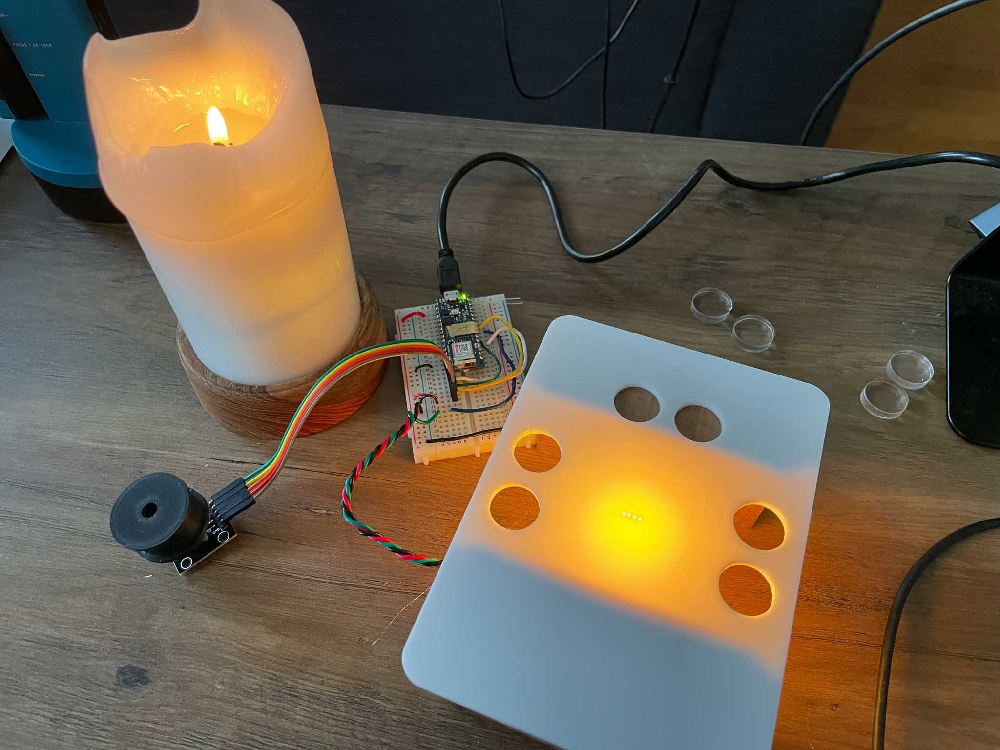

 I ended up with a hue range of about 3400-5400, though it tended towards the lower end of that range when I dimmed my lights further. I decided on a base color of #4D1D03, which through the white acrylic diffuser, seemed to mach pretty well. This acrylic was a random off-cut from the junk shelf, but I felt it recreated the white wax pretty well. I tested this with frosted satin-ice acrylic and other translucent acrylics I had around, but they all seemed either too transparent or I felt they held the color wrong. 

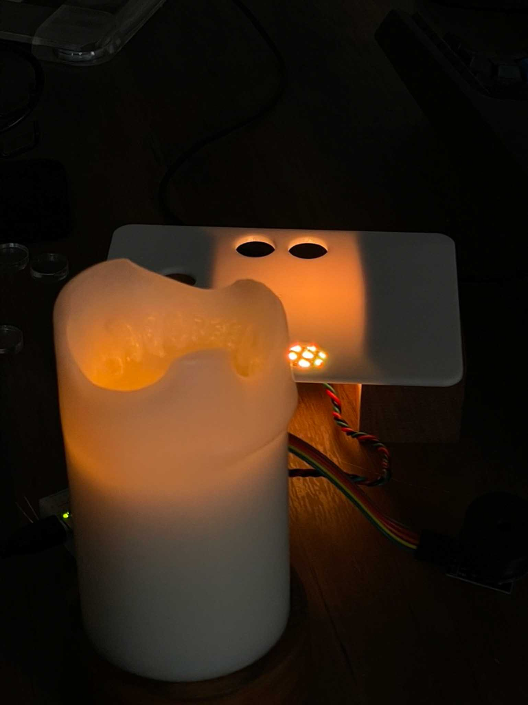

---

Once I’d gotten color reproduction down to my satisfaction, I needed to build a body for the candle. I did this before playing with animation or other tweaks, because I had the sneaking suspicion that the base + diffuser of the candle would have a large effect on everything else. 

I started with this spare chunk of walnut that I sawed flat. 

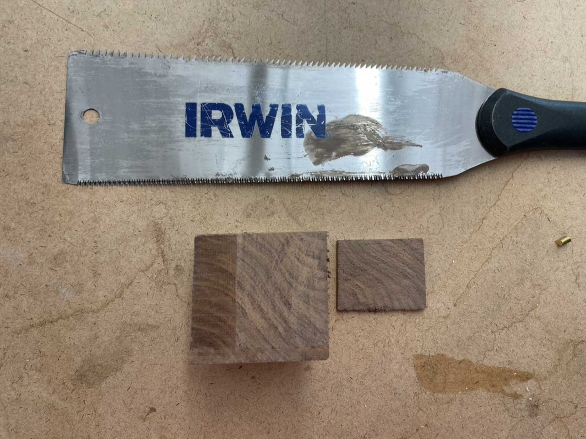

I took this block to the drill press with several forstner bits, slowly stepping up in size until I had a good-enough sized hole.  

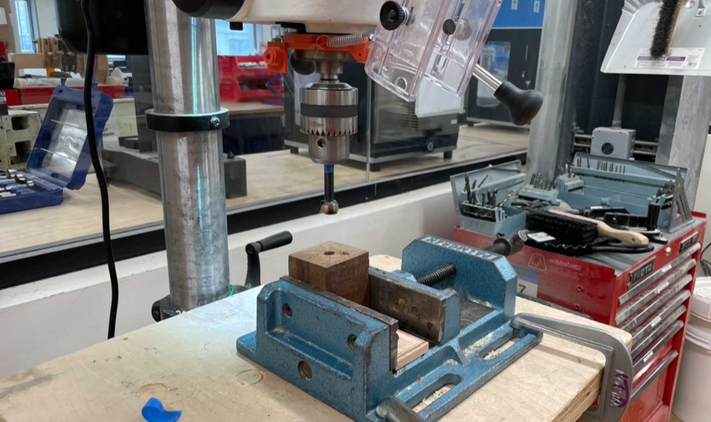

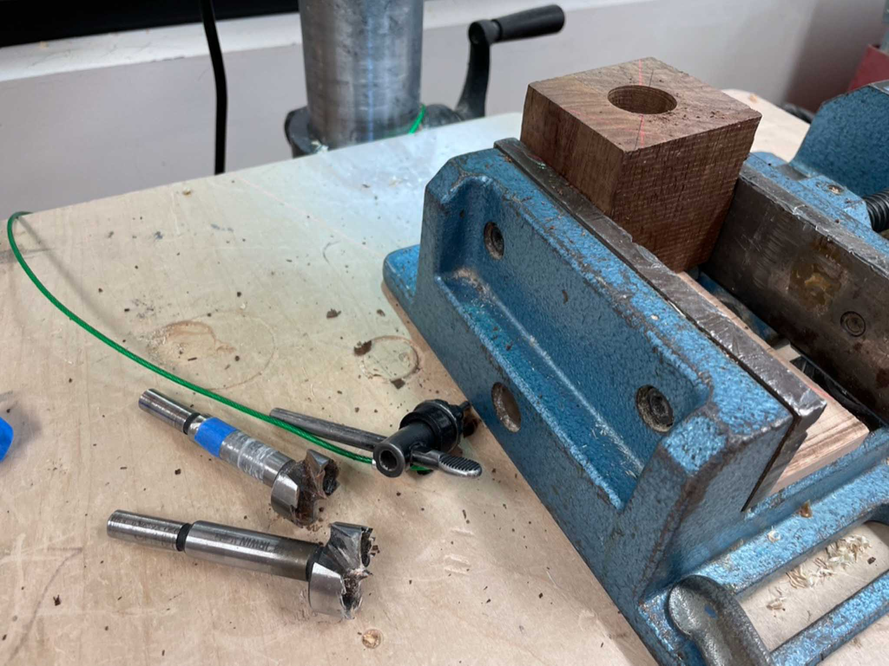

The final walnut block has a 1 5/8” diameter hollow, made on the drill press, with a 2” diameter depression at the top for an acrylic piece to sit in. I also drilled a hole into the side for a microusb plug. 

---

Based on the size of the block I wanted to use, I needed to size down the microcontroller to fit. I went for a Trinket M0 (co-opted from another project, so already soldered up), and managed to re-configure the Jewel’s wires to sit directly atop the Trinket’s header pins. 

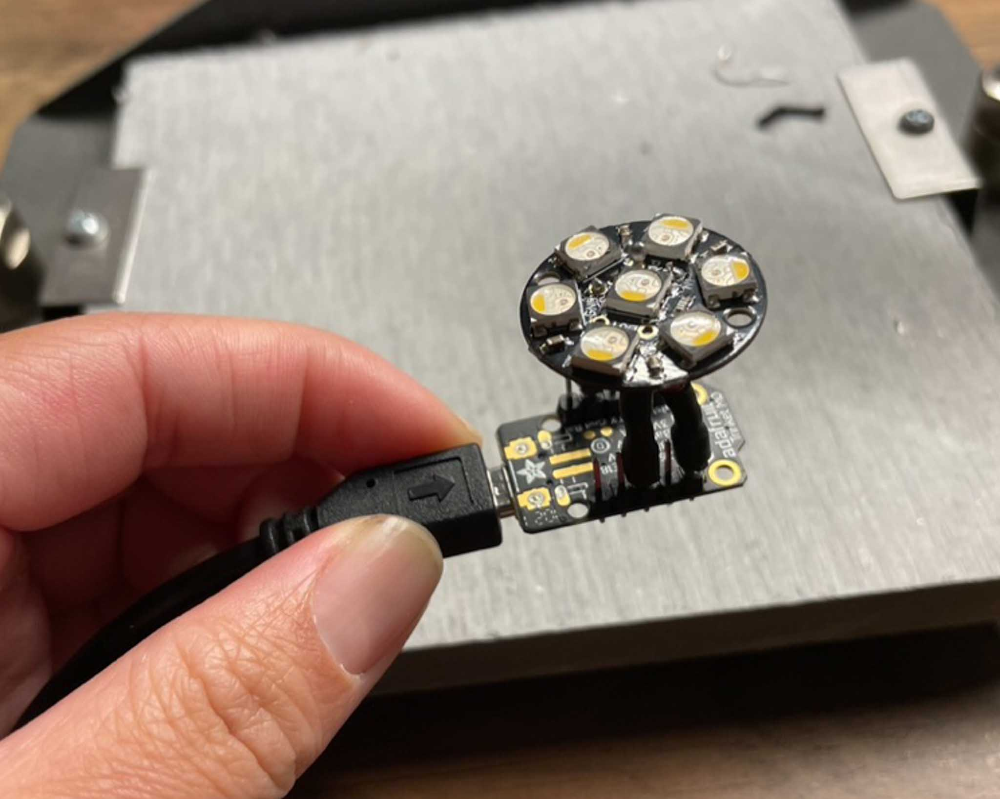

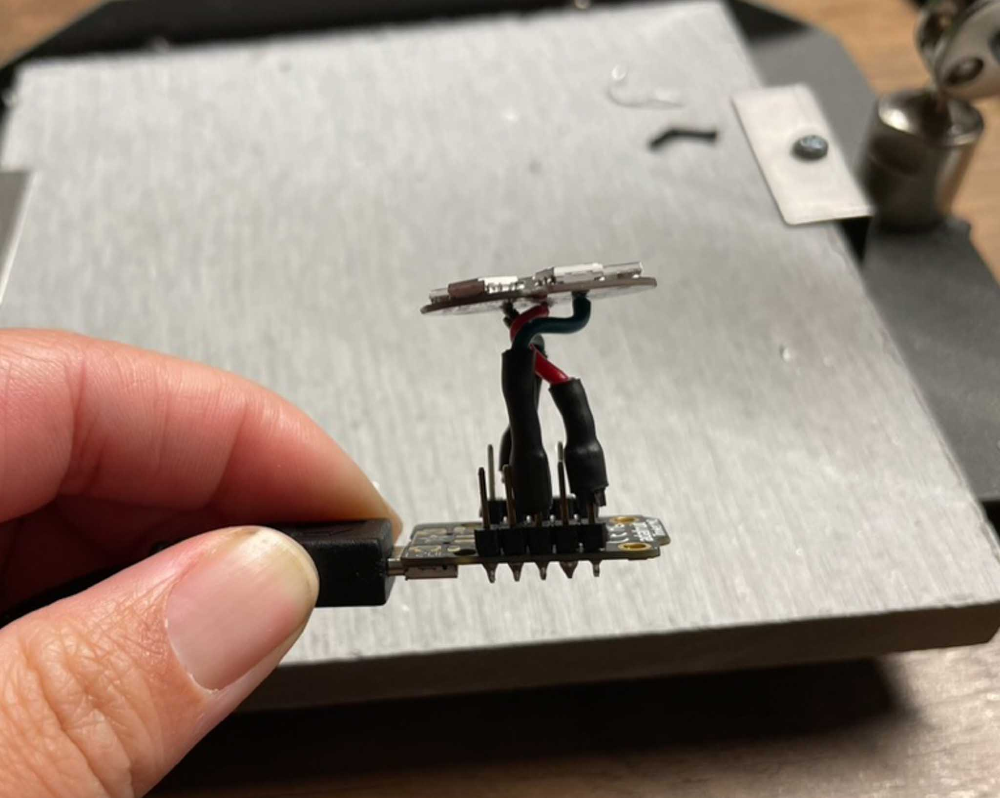

This tiny form factor fits well (if a little loosely) inside the hollow. I added a small ring (prototyped in cardboard and someday to be re-made in acrylic) to fit the Jewel to the full diameter of the hole, and included standoffs to raise the acrylic diffuser off of the LEDs. 

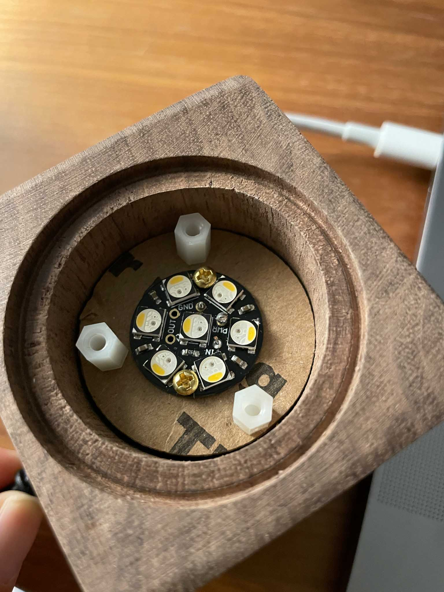

---

As for the diffuser, there was some playing around. For a solid 25 minutes, [Adnan](https://adnanaga.com) and I collaborated because of a few serendipitous design choices, leading to his 3d-resin-printed campfire fitting nearly perfectly into the well that I’d created. 

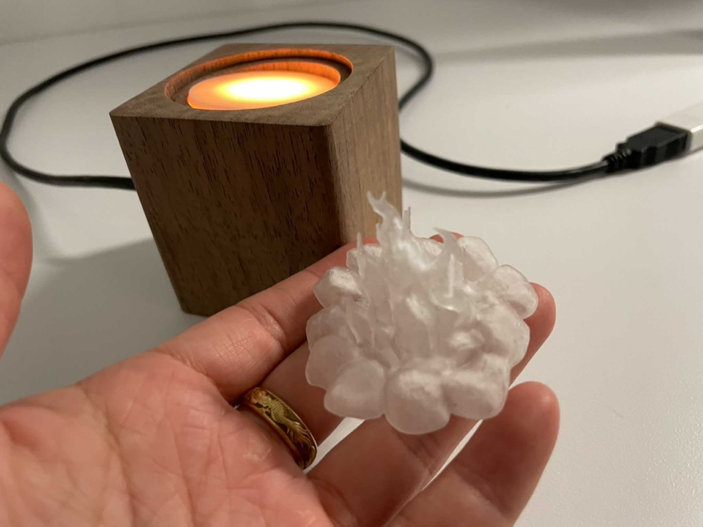

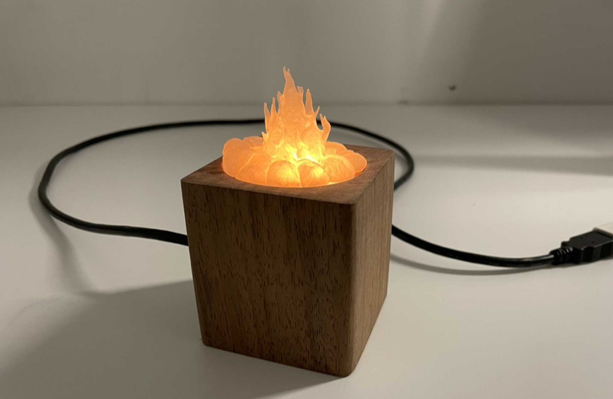

However, it soon become clear that his campfire *****read***** as a campfire much better on a low, wide platform, so our collaboration was thus ended. 

I ended up following my original plan of using a white acrylic as a diffuser. I soon realized that while the low and almost-opaque diffuser reproduced the *****color***** of the candle, it didn’t really reproduce the ****body**** of one. To try and build more volume, I added two extra layers of frosted satin-ice acrylic to “pull” the light upwards out of the candle. 

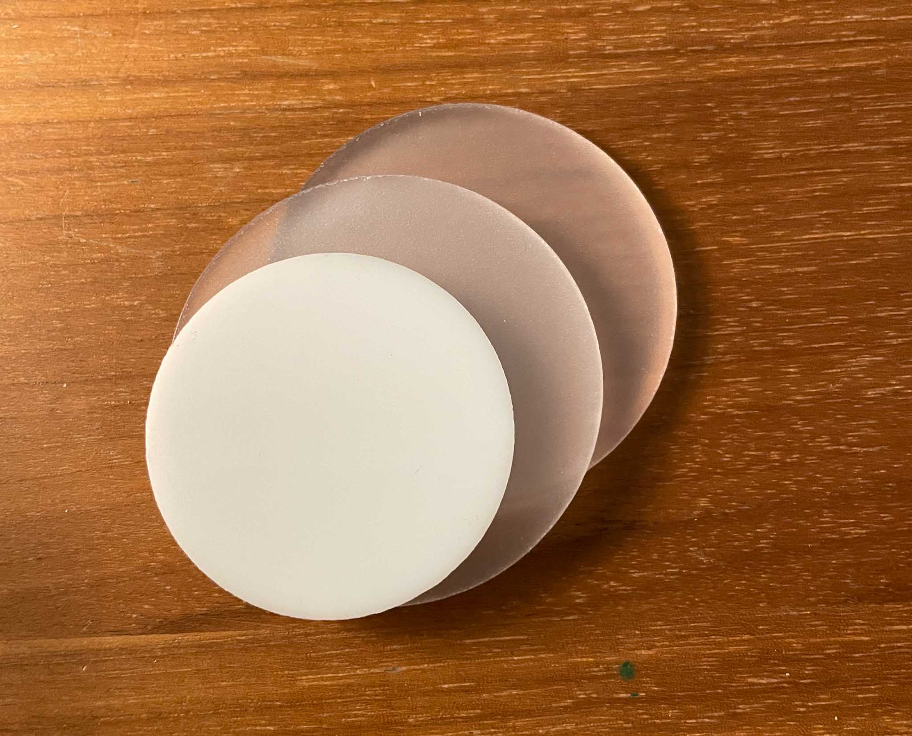

For animation, I changed two things: value and hue.

Value changes overall (as in, all pixels are the same value), and moves higher and lower by set steps within an upper and lower bound. Direction of those changes are random, with a 5% chance of happening. I found that changing the value of all the pixels at once gave the most “round” light effect, matching the radius of light I saw on my candle. 

Hue also randomly changes within an upper and lower bound, but each pixel changes separately. While they start at the same hue, the pixels will shift over time. I think the effect is subtle, but I enjoy it. 

[Code is on Github here.](https://github.com/leils/itp_spr_2023/blob/main/light/02_candle_trinket_moving/02_candle_trinket_moving.ino) 

---

Overall I’m very pleased with the candle. Videos and photos don’t do it justice, but here’s a go anyway:

https://youtu.be/kyY9sU98ghs 

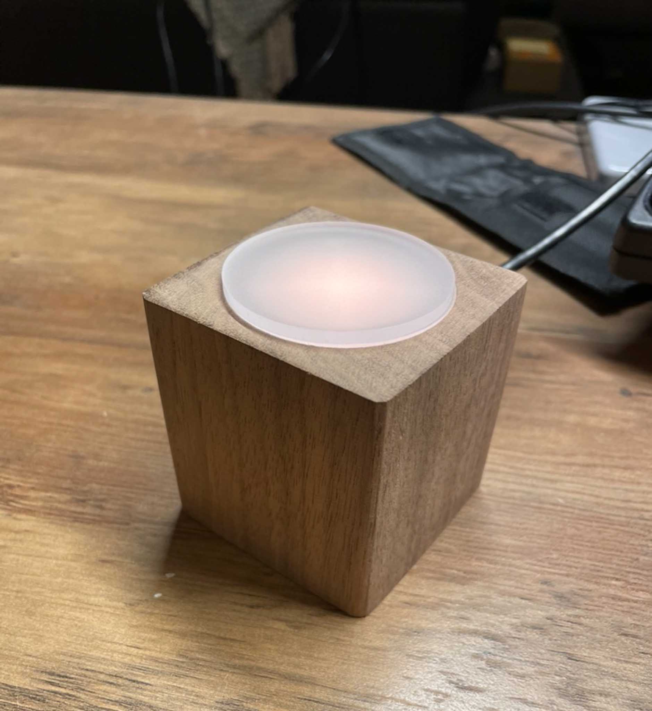

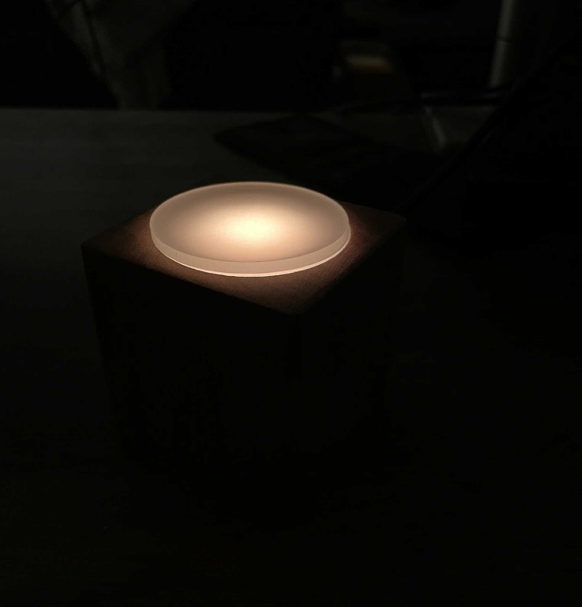

---

## Measurements:

The light from the real candle vs fake are definitely a bit different. With the Spectromaster, I measured the LED candle to be around 17 lux while the real one hovered around 21. While I think part of that difference comes the light emanating from the bare flame, my false candle really doesn’t “hold a candle” to a real one. :P 

---

## Other Reflections & Notes:

- I also tried out this code on a Circuit Express Playground, to see if I could leverage the built-in microphone and LEDs to make something more interactive. However, I found the large circular formate to spread the light a bit too sparsely, and I couldn’t see an easy way of simultaneously diffusing the light with a cover while leaving the microphone open for interaction.
- I really like this candle, and find it very comforting to have on at night. I’d like to modify this by stabilizing the interior with some more structure and add a small battery, as well as add a panel-mounted micro USB port on the side. I’d also probably take some more sand paper and a nice danish oil to the wood to clean it up a bit.
- While I had this on my coffee table, I kept finding myself avoiding reaching over it in fear of the flame. Silly!
- The Trinket M0 has a built-in DotStar, which is useful but particularly annoying in this case as it automatically is set to a bright purple. I needed to add extra code to turn it off, so I have both NeoPixel and DotStar code.