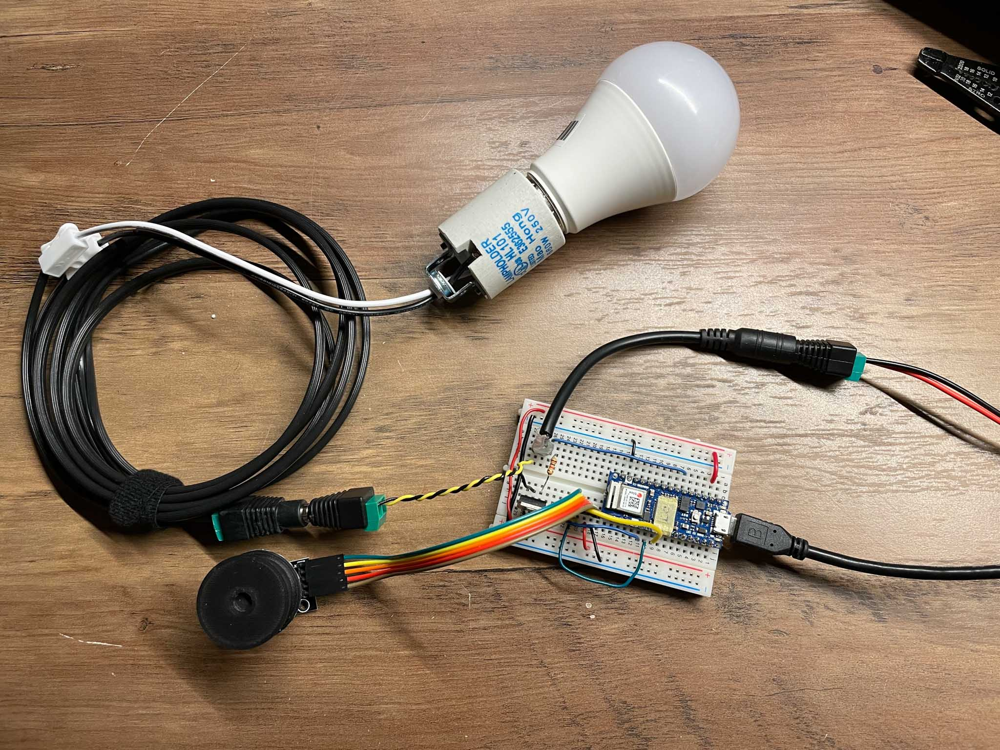
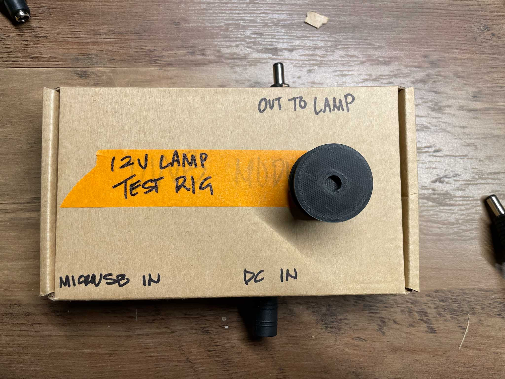

This week, we were tasked to creating a test rig for a 12V DC lamp. A few of us went in on a set of E26 bulb sockets, which were unfortunately not delivered until Tuesday. In the end, I managed to set up a bit of a test rig. 

Requirements for the test rig: 

- 1m cable
- Dim bulb + on/off control

I based this rig on my setup for the LED fade; a rotary encoder and Nano IOT 33 are central components to the circuit. I’d worked a bit with the TIP120s in an earlier project controlling solenoids, so I grabbed parts from prototypes of that project. 

After setting the circuit up for 12V control I tested out my original fade code and wow! it works!

https://youtu.be/xThp0QMPPRU

I made up a little box for it to make carrying it around easier.

This is where I stalled; the LED bulb faded well, but a) made a high pitched noise that I didn’t love, and b) got a bit unnervingly hot. So I put a pin in this and hope to go over the circuit once more before building a more permanent version of this.

Notes: 

- Wire joints are my best friends. They are so incredibly convenient.
    
    
    
- I definitely shocked myself at least once. It’s not terrible, but it’s certainly uncomfortable.

---

Also, some lights that I enjoy: 

[https://vibekefonnesbergschmidt.dk/lighting/](https://vibekefonnesbergschmidt.dk/lighting/)