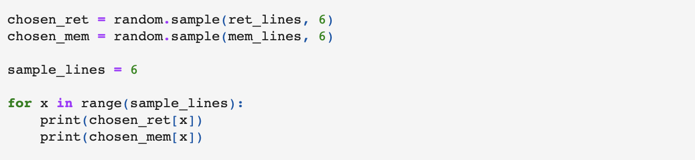

> Assignment 2: The digital cut-up. Create a notebook program that reads in two or more texts and stores portions of them in Python data structures. The program should create textual output that creatively rearranges the contents of the text. Use functions from the random module as appropriate. You must use lists as part of your procedure. Choose one text that you created with your program to present in class.

In this experiment, I take a poem I wrote last summer about retrieval-induced distortion and intermix it with the introduction to the Wikipedia article on retrieval-induced forgetting.

Original poem: 
```
Retrieval-induced distortion;
a phenomena in memory 
where a memory, sweet or sour, 
changes as you remember it. 

When you trace the line of your memories
Tug the string, pull them from the ether
lay them out on the deck 
and they mutate, stretched thin by your tugging 
smudged with your fingerprints 

I remember a day as a toddler
a wood-burning stove, warming the house
and a frozen winter beyond glass sliding doors. 
only this memory reads 
back and forth 
from a VHS tape. 
```

Plucked lines from Wikipedia: 

```
Retrieval-induced forgetting (RIF) is a memory phenomenon 
where remembering causes forgetting of other information in memory. 
The phenomenon was first demonstrated in 1994, although the concept of 
RIF has been previously discussed in the context of retrieval inhibition.

RIF is demonstrated through a three-phase experiment consisting of study, 
practice of some studied material, and a final test of all studied material. 
Such experiments have also used multiple kinds of final tests including 
recall using only category cues, recall using category and word stems, 
and recognition tests. The effect has been produced using many 
different kinds of materials, can be produced in group settings, 
and is reduced in special clinical populations.
```

---

I used random functions to intermix the lines of these two texts. I sample 6 lines each from each origin text, and alternate between them. 



```
lay them out on the deck 
RIF has been previously discussed in the context of retrieval inhibition.
I remember a day as a toddler
different kinds of materials, can be produced in group settings, 
a wood-burning stove, warming the house
Retrieval-induced forgetting (RIF) is a memory phenomenon 
a phenomena in memory 
recall using only category cues, recall using category and word stems, 
When you trace the line of your memories
Such experiments have also used multiple kinds of final tests including 
only this memory reads 
practice of some studied material, and a final test of all studied material. 
```

I really enjoy this final run, and how simultaneously in sync or in conflict the various lines are.
[Jupyter Notebook](https://github.com/leils/itp_spr_2023/blob/main/rwet/02_mixed_lines/mixed-lines.ipynb)