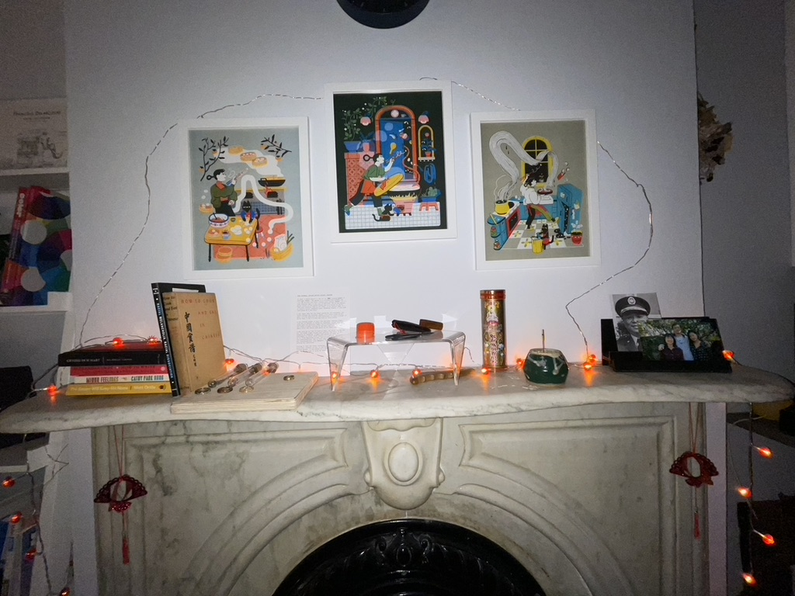
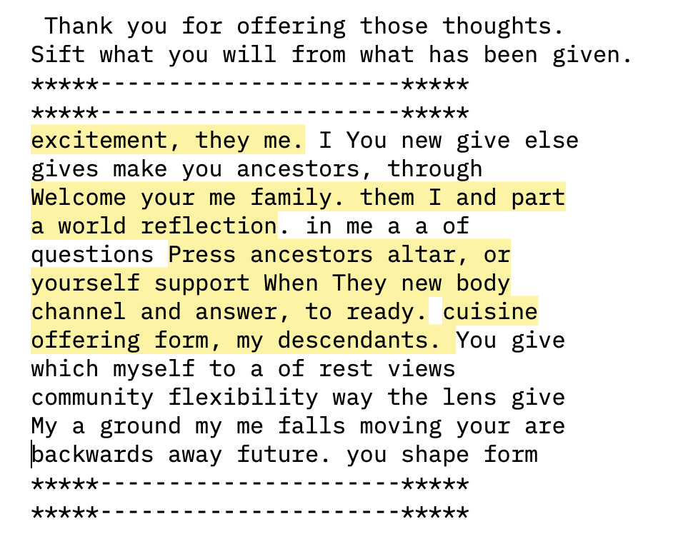
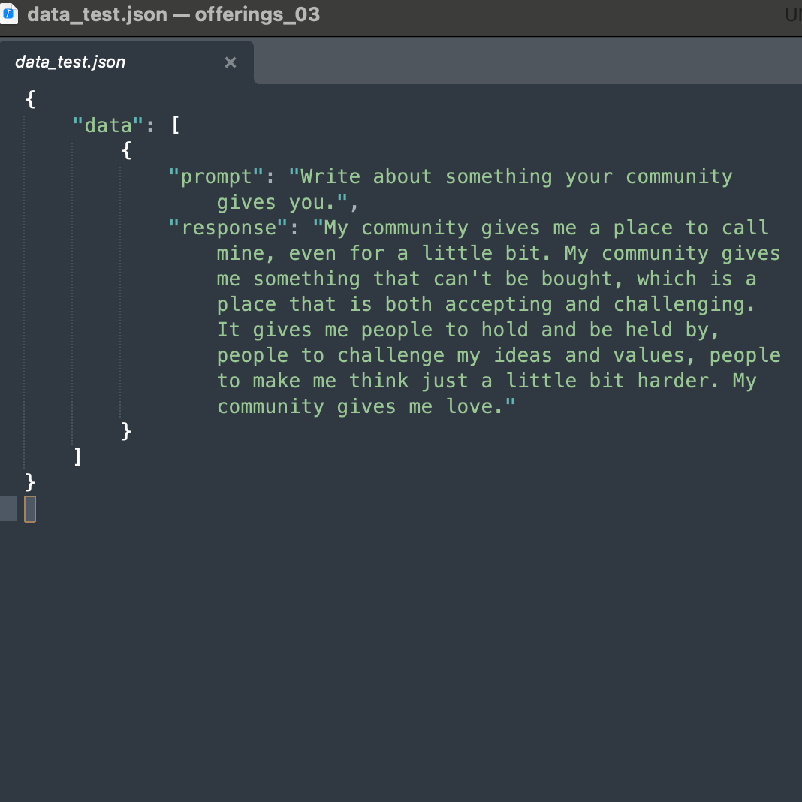
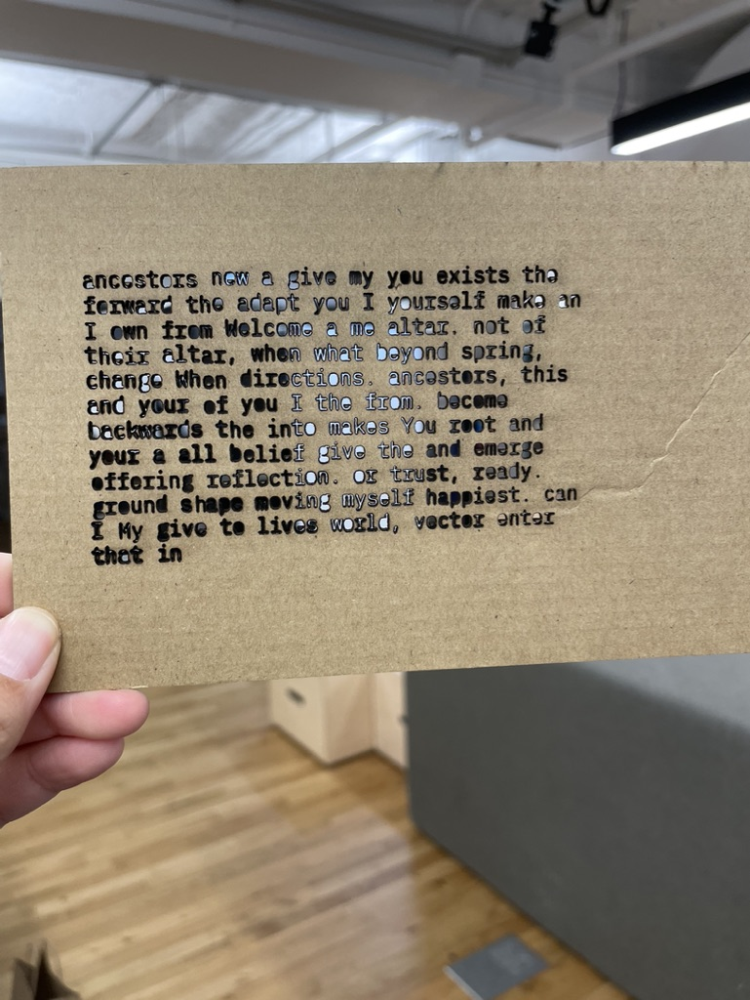
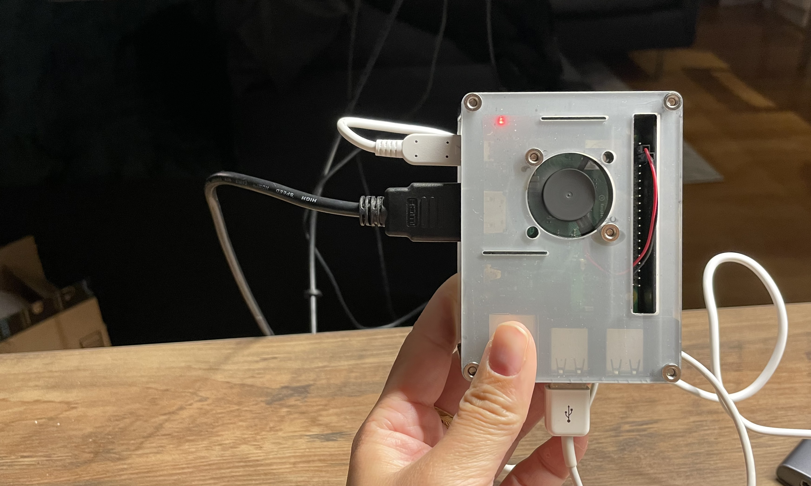

Welcome back, everyone. We’re in the swing of the new semester, and things have been progressing. 

## Prototypes V1

Over the break I took the time to talk to my family, gather information, and … well, actually take a much-needed break. Alongside gathering more family photos for use in my proposed mutating portrait, I also started to record my recipes and their alternates.

An example of this:

```
## Lo Bo Gao : Radish Cake :

Ingredients: 

- Chinese Radish : Daikon
- Rice Flour
- Chinese Sausage : chinese bacon :
- Cornstarch
- Salt
- Sugar
- White Pepper
- Dried Shrimp : leia can’t have this :
- Dried shiitake mushrooms : fresh shiitake : nothing
- Vegetable Oil : rapeseed oil : avocado oil

Tools

- A metal bowl : glass tupperware : square baking pan
- Box grater : food processor : just be handy with a knife
- A wok : the instant-pot : a basic pan you can put water in

Instructions

1. Grate : chop : process your daikon : radish 
2. Cook your daikon : radish with a cup of water until the daikon : radish softens releases its water, and a bit of it evaporates. Remove the daikon : radish and liquid.
    - don’t let it brown!
3. Saute the oil, shrimp, mushrooms, sausage.
4. Mix the daikon, some of the water, rice flour, cornstarch, salt, sugar, and white pepper in a bowl. Add in your add-ins.
5. Wait for the batter to thicken.
6. Pour into the well-oiled pan.
7. Steam for 50 minutes 
8. Let cool, the remove and slice.
9. Serve with oyster sauce : hoisin sauce : chili oil : soy sauce : vinegar
```

These recipes became this quick prototype:

https://youtu.be/11QpERY2T2g

I find this pretty interesting, and related to a bunch of my earlier explorations during last summer’s 50 days of making.

## and yes, the altar



This altar was created out of my mantlepiece, under the thought that “we all have altars, and an altar is just a place that we have designated as sacred for one purpose or another”. This form both mimics traditional altars (with incense, and portraits of ancestors) and focuses on changes of the concept. The changes are:

- Portraits of the family, not just deceased ancestors
- Artifacts of “culture”, in the form of family heirlooms alongside objects purchased because of their relationship to my heritage (such as a pair of cast-iron scissors manufactured in Taiwan)
- Books that I consider related to being “Asian-American” (including the first traditional Chinese book written in English, and several modern novels written by and about Asian Americans)
- Another piece of artwork I created focusing on identity: [what identities do you choose to wear](https://www.leiac.me/2022/2022-12-09_what-identities-do-you-wear/)

I also tested my two proposed altar objects (the fogged portrait and the changing offering recipe book) on the altar by playing them on an iPad propped on the mantle.

### Feedback & Feelings

I ran this altar by a few people, and overall it got a pretty positive reception. People liked the look of the altar, and the way it incorporated modern and forward-looking items rather than just backward-looking ones. However, this prototype re-upped a few questions I’d been asked last semester: 

- How does an altar engage a community? How do I intend to involve people or a community? To generate community? To generate connection? A feeling of belonging?
- What is the act of worship or offering, and what does it mean?
- Does the altar need to live in my own home? How does it intersect with the “home” of my community?

This piece was informative but ultimately did not strike the chord I was looking for. I treated it as a traditional altar, lighting incense at it every morning and bringing it “offerings”, including fruit (fairly traditional) and written notes around the concept of lineage. 

The lack of resonance in this prototype have sent me in a new direction. 

---

## Prototypes V2: A New Direction

I’m re-focusing my work on two foundations:

1. Creating a piece that actively engages me in processing my relationship to heritage and culture 
2. Creating tools/space for the sharing of stories, and connecting with people over those stories.

While the final piece may still take the form of an altar, the core of the interaction is being adapted to focus on writing instead. Of all the things I played with in the prototypes above, the “offering” notes resonated the most for me. 

When working with words, find myself very interested in “nonsense”, and what it feels like to read something different out of your own words. I’ve created a python script that prompts me with various questions, and uses my input to write back a “word salad” of my own words mixed with the prompts. There’s something really engaging about finding unexpected meaning in this set of random words, and further interesting about those words coming from my own writing.

Here’s an example of the prompts and input from a single session:

```
Welcome to the altar.
    You are your ancestors, your descendants.
    You shape not moving forward or backwards but in all directions.
    When you make an offering to this altar, you offer yourself a moment of reflection.
    Press enter when you are ready.

Please, share a few things.
Tell me about something your ancestors give you.
----------------------
My ancestors give me a cuisine to ground myself in, a lens through which the rest of the world views me. They give me my body and my form and my family.
----------------------
Thank you.
What is something your community gives you.
----------------------
My community gives me support and excitement, questions to answer, challenges.
----------------------
Thank you.
Describe something you give your ancestors.
----------------------
I give my ancestors a new form, a way of looking into the future. I give them a channel through which everything else falls away and they become part of a new world. I give them flexibility and translations.
----------------------
```

The output from the above interaction is as follows. I’ve highlighted the output that strikes me as interesting.



I’m finding these words much more interesting as a form of “offering”, particularly the framework of this action offering ******myself****** a moment of reflection. 

I did a second test too, a script with only one prompt and no randomized response, but logs my entries as data for use later. (Bonus: keyboard ASMR. Why do I like this sound so much?)

https://youtu.be/72wJpdM89Wo



### But what to do with the words?

Leaving the words on the screen doesn’t quite feel like enough. I envision an archive of all the input (alongside randomized output) for people to look through, like a journal with its pages spread out. [My Winter Show project](https://www.leiac.me/2022/2022-12-17_what-i-can-remember/) showed me that there’s a lot of power and resonance in sharing personal stories, and that’s the feeling that I hope to find at the end of this process. 

 I’ve toyed with bringing the words out into the physical world, in engraving and laser cutting. I’m not sure where this is going yet, but the see-through words are very interesting to me.



### Feedback and Feelings

I brought these new ideas to my fellow ITP-ers and a few mentors. My takeaways from their feedback:

- Focus on building something that works for you, and the rest will follow. ~*Blair*
- There’s an interesting dichotomy between the “coldness” of the terminal and the warmth of the words/writing. ~*Jinny*
- The archival nature of the project lends to a feeling of tangibility … like it should be printed ~*Several people*

> This feels like a journal … a safe place I wished I had … a soundboard

### Next steps

- I need to move this script and process off of my personal computer. Engaging with this on my laptop (where I do everything else, from writing this Thesis to watching tv) makes the act of engaging less precious. I don’t want to lose the sacred-ness of the altar form. I’ve started by moving this script onto a Raspberry Pi, which I’m working on creating a housing and interface for.
    
    
    
- I also want to source words from the interviews I conducted last Fall. Talking with others about their own immigrant experiences have been key in my processing. I want to find ways of encouraging and fostering that connectedness.
- Once the core mechanic is working for me, I want to open up the usage of this “altar”/device to others in my community.