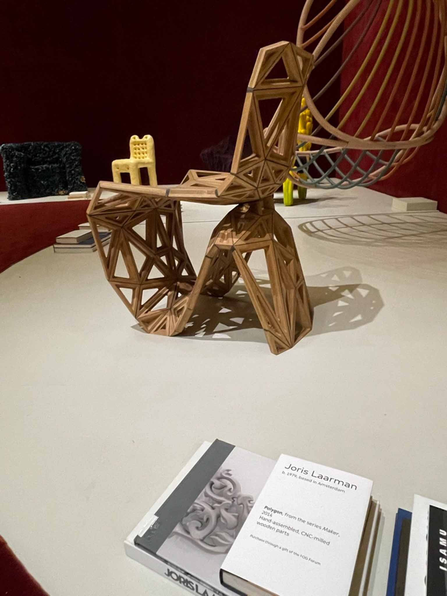
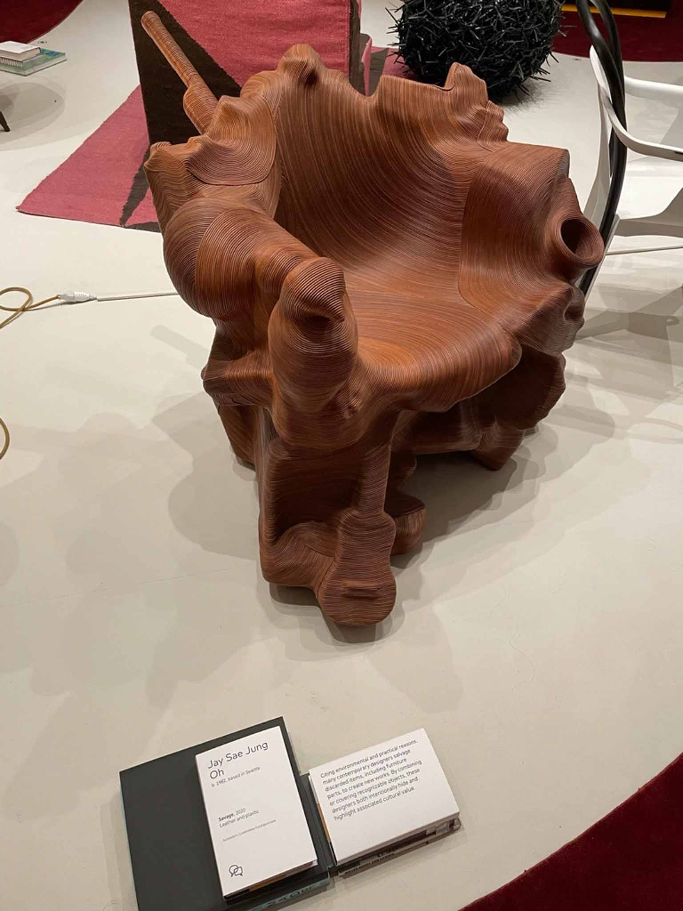
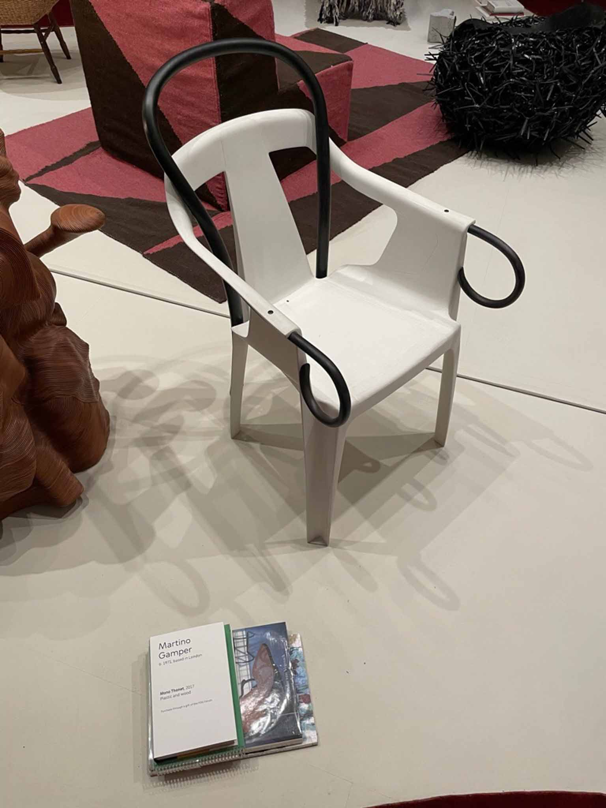
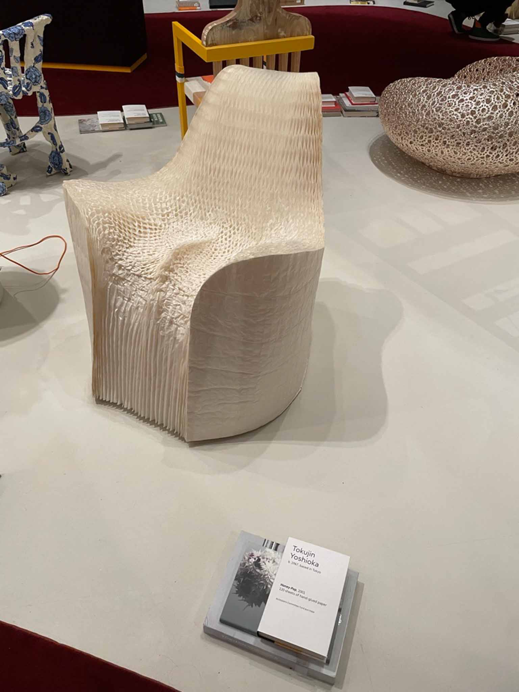
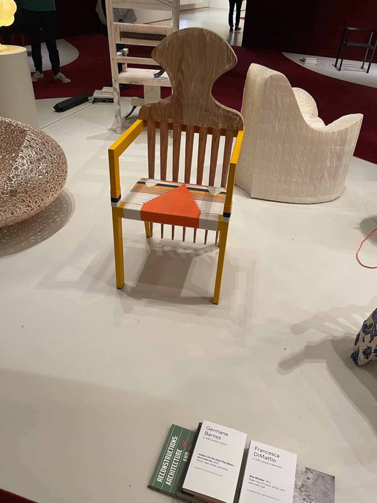
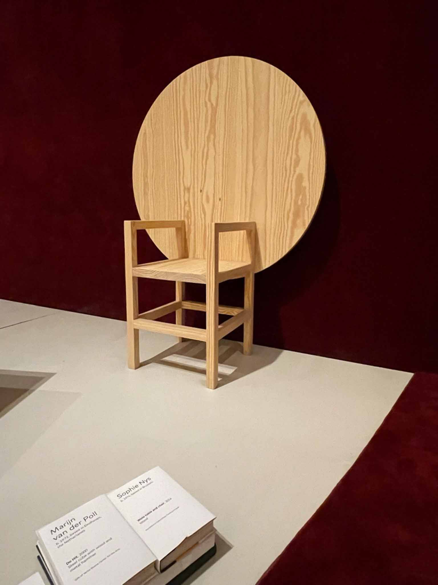
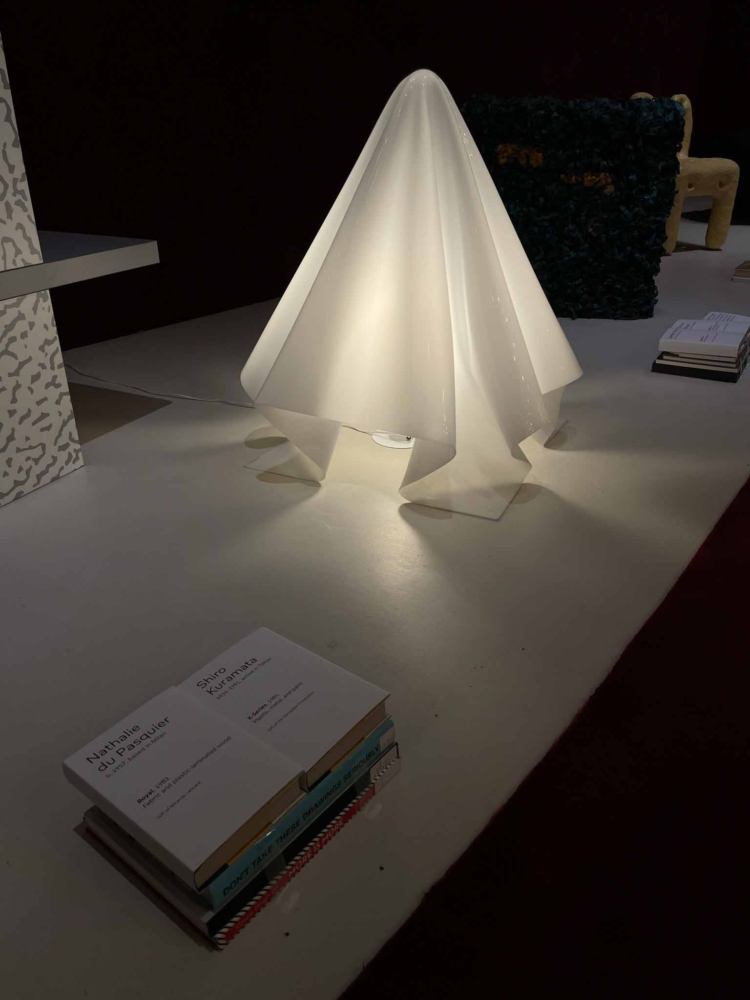

## [Conversation Pieces](https://www.sfmoma.org/exhibition/conversation-pieces/)

Conversation Pieces is an exhibition of modern and contemporary furniture whose forms and ideas incline them towards a museum gallery rather than a showroom. These pieces range from fascinating new forms to unusual materials to deeply interesting concepts. I thought the presentation of this show was absolutely incredible. 

Some of the things about the gallery design that stand out to me: 
- The entire room was lush and comforting, coated in a deep red carpeting that bucks the notion of a white-wall gallery. This carpeting ran not only on the floor but up the walls, like a smoking room. 
- The lighting was dim, but they used a brilliant white form to brighten and raise the dark room. These white forms reflect the areas that the furniture was arranged in on the floor, creating a vertical separated space from the walkways. 
- Rather than having the typical plaques, each of the pieces was titled on white-covered books sitting on the floor. While unconventional, these books recall the coffee-table-book nature of these furniture items and also allow for the showcasing of books created by or for the individual designers. 
- The round shapes! This entire exhibition was done in rounded, curving shapes, even the entryway. So cozy. 
Overall, it really feels like this exhibition was designed by someone who both really loved the pieces, and had a lot of fun. 

Some pieces that I liked: 

- chair made of clay, coated in a protective plastic layer 
- a flocked rock that i wanted to touch desperately 
- chairs that question the nature of their materials 

LED-and-plexi lamp by Johanna Grawunder

Glass-blown lamp by Bethan Laura Wood

Formed-acrylic lamp by Shiro Kuramata.

Antifragile Hanging Piece No. 3, Kwangho Lee 

---

## [The Visitors by Ragnar Kjartansson](https://www.sfmoma.org/exhibition/ragnar-kjartansson-the-visitors/)

Literally just an incredible show. Created of a single hour take, multiple rooms of a house are recorded and each musician gets one. The directional sound and intimate shooting make it feel like you are a part of a precious, fleeting moment even as you know it will run again as soon as it’s over. You whip your head left and right at the different rooms, trying to catch glimpses of everything happening at once. 
I feel the splash of the bathtub, the throb of the bass. I smell the smoke of the cigars, the sticky sweet champagne, the musty sheets. I feel the air cool as they leave, walking barefoot into the grass. 

I hear that this show used to be set up differently, as a single room bisected by two screens such that you cannot see all the screens from any position. I do wish I could have seen this setup, as I think it might have been more interesting to watch the crowd choreographed by which musician was soloing at any given moment. 