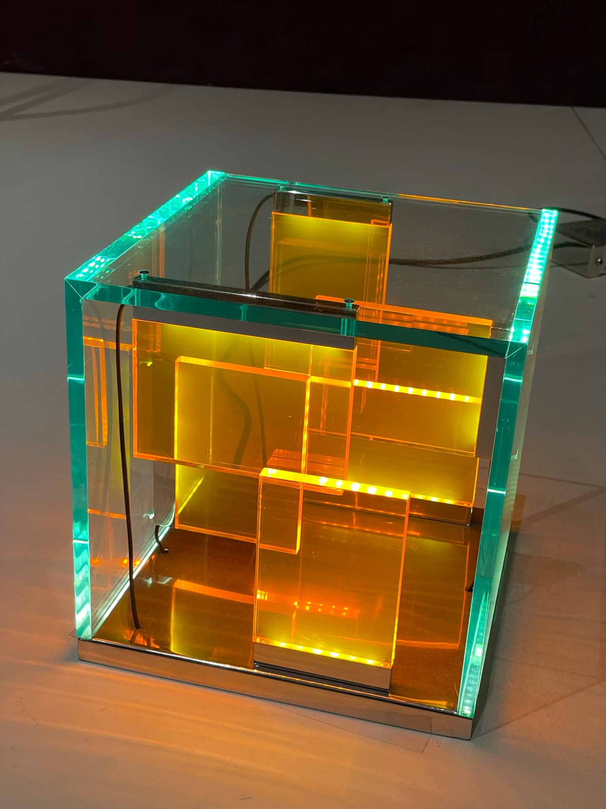
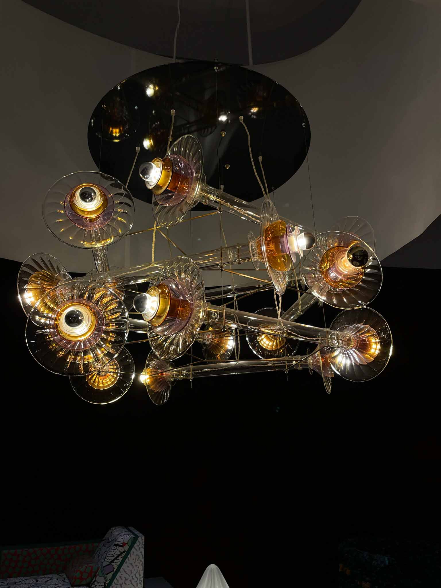
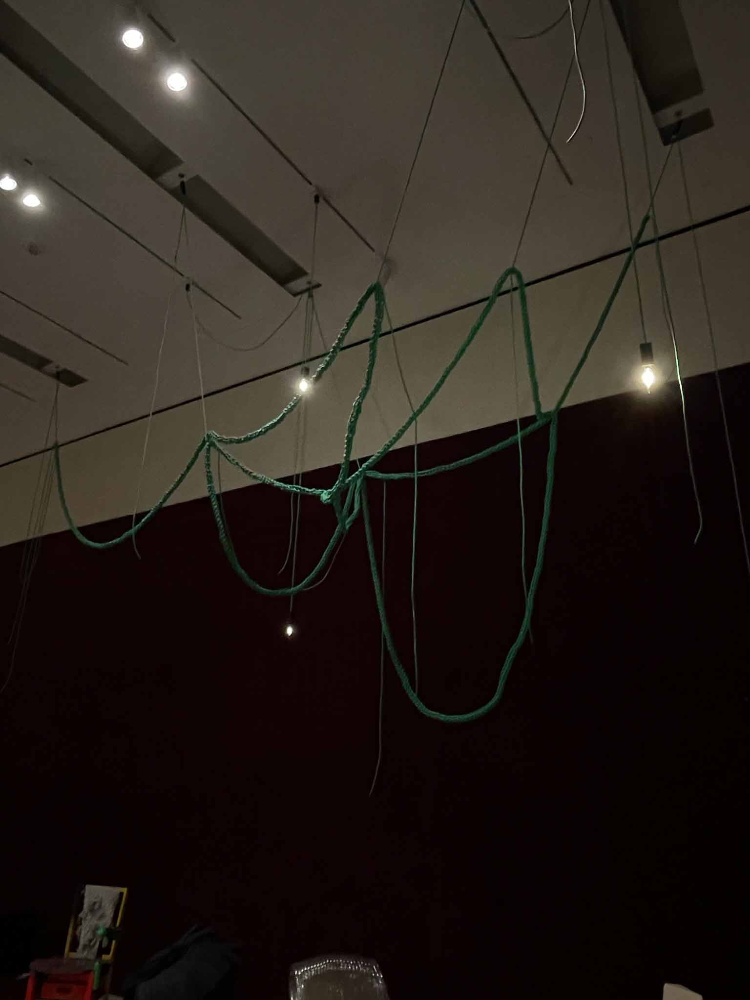

As I’ve been traveling for the last 6 days, I haven’t had a chance to set up a 24 hour timelapse. I’m still interested in doing so though, so I might take a stab at it this upcoming week. 

Instead, I tried to study the lights that I encountered while on the go, which are showcased and described on my Tumblr collection.  

I also visited the SF Moma, which had a very interesting exhibition on display called Conversation Pieces. The premise of the exhibit was to showcase furniture and other household objects whose design diverges from strict usability or conventional expectations. The furniture pieces were quite interesting (you can see more of my thoughts and snapshots from this in my [Field Notes](https://www.leiac.me/2023/2023-02-28_field-notes-moma/)), but the lights in particular were quite beautiful.
The description of the exhibition explicitly calls out these lights as non-task lamps: lights that function more in the realm of aesthetic and intrigue over functionality. However, the way that each of these pieces approaches this is very different. 

---

First, this LED-and-plexi lamp by Johanna Grawunder
Things that stand out to me: 
- The modernist form accentuated by color seems bright and clean, while not being minimalist. 
- Edge-lit acrylic doesn’t fully hide the shape of the LEDs, but the light shines in multiple directions and reminds me of a CMYK crystal.
- The power box behind the lamp is interestingly industrial; an almost clunky aluminum/steel box. 

---

Next, this glass-blown lamp by Bethan Laura Wood
- This light looks incredibly different from all angles. The glass pieces catch the light in riveting, undulating ways like ripples in water as you move past. 
- The overall tone of this is lamp is warm. Oranges and reds, almost browns are radiated from the lamp. 
- The cables are strung through the clear parts of the lamp, not through the brass rods! Their fabric-like appearance contrasts with the solid brass and glass. 

---

Lastly, this formed-acrylic lamp by Shiro Kuramata.
- This light absolutely blows me away. It’s simple, solid and liquid at the same time, soft and hard. 
- I love how the layers of material change everything here. The thinner single layers really let the light through, and it almost floats on its own. 

---

As a bonus, here's a cool fixture that, while it has a bare bulb, I enjoy for its creative use of the cord itself. 

