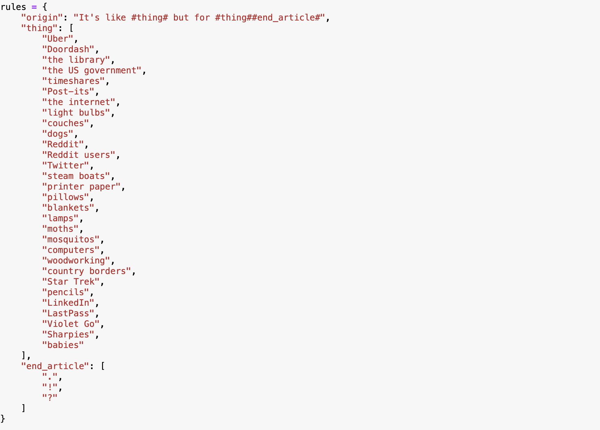
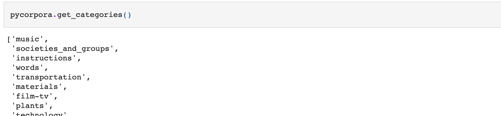
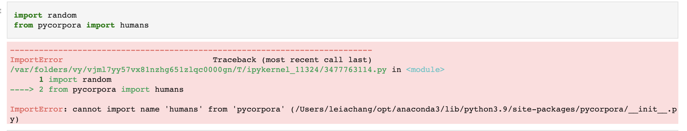

> The genre study: Choose a genre or form of writing. This can be anything from a literary genre to a meme format. Gather a small number of exemplars of the genre and make a list of the characteristics that are common to all of them. Write a program that produces texts that emulate a particular form or genre of language.

A simple setup: "It's like but for !" There's a whole set of tech memes about startups, where all of them are "Uber but for X". [This is a good example](https://www.quora.com/Uber-for-X-What-startups-are-working-on-Uber-for-X) of (surprisingly not satire) companies and services that are based on this model. Here's a [Buzzfeed Article](https://www.buzzfeednews.com/article/charliewarzel/like-uber-but-for-jokes) on the same thing.
Examples: - It's Uber, but for food. - It's Uber, but for books. - It's Google, but for jobs. - It's LinkedIn, but for dates.
Pretty straightforward! So here's a quick run of this: The "things" are random, pulled from the top of my head.

It's not bad, but I wanted to be able to source my "things" from a database, not just manually thought of and written. 
Somewhere in the long list of tutorials was a link to the [Corpora Project](https://github.com/dariusk/corpora), and subsequently the [pycorpora port](https://github.com/aparrish/pycorpora). 

Now, I did try this late at night, so perhaps that has something to do with my inability to make this work. At first, I installed pycorpora via pip, but that install does not include any data by default. 

I re-installed defining the Corpora database. This gave me access to the categories I expected, but when trying to actually access words, I had a lot of issues. 

I'll have to take another look at this, perhaps locally first (rather than through Jupyter). 

[The Jupyter Notebook is available here.](https://github.com/leils/itp_spr_2023/blob/main/rwet/Hw%2003.ipynb)