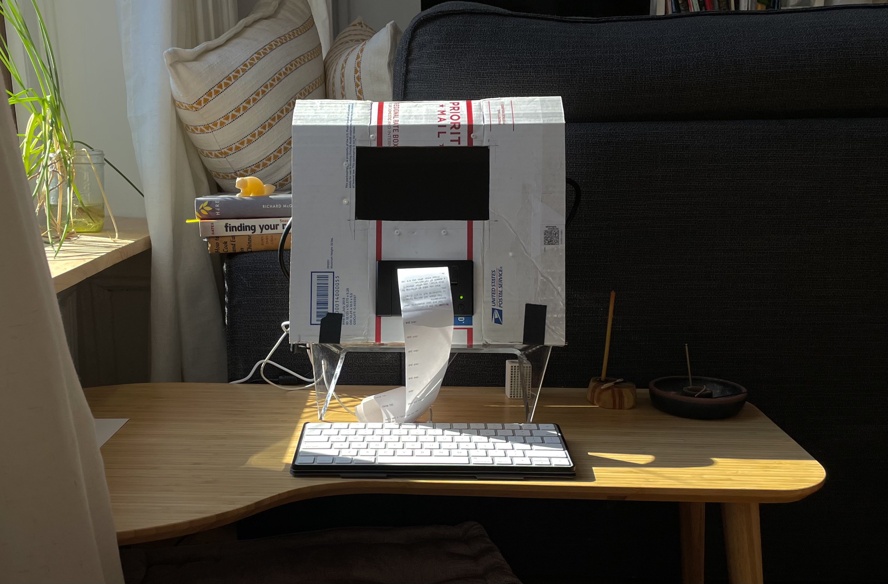
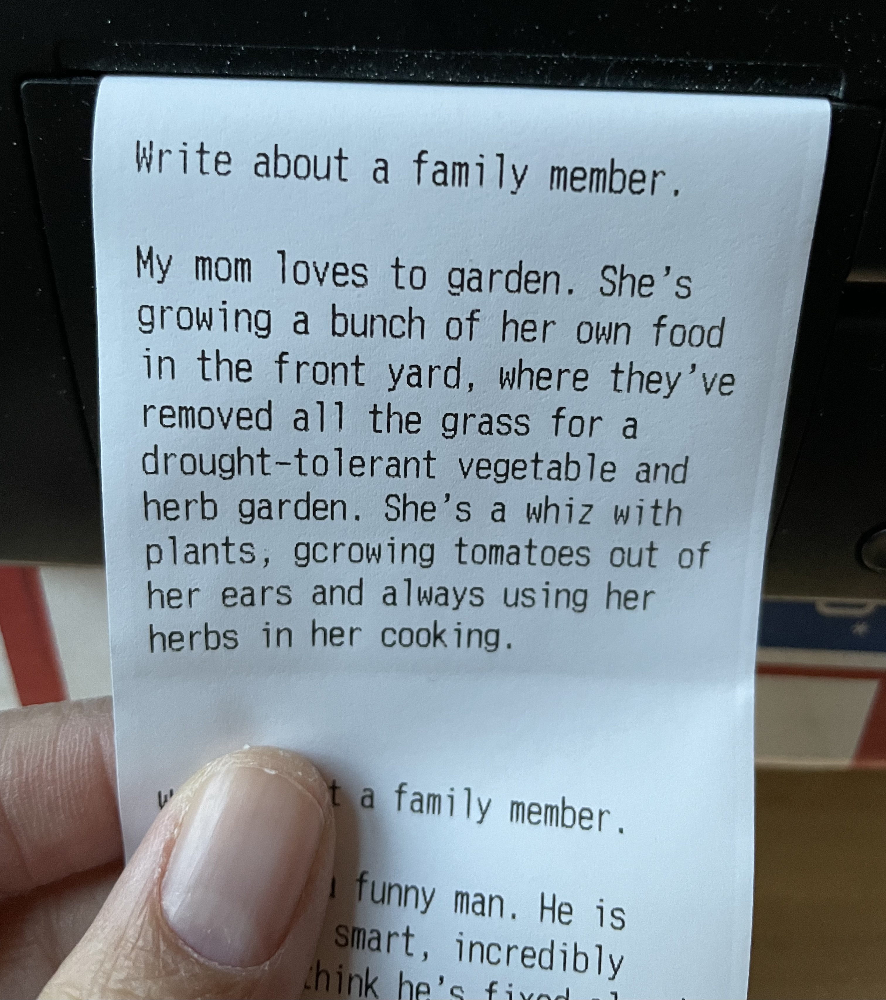
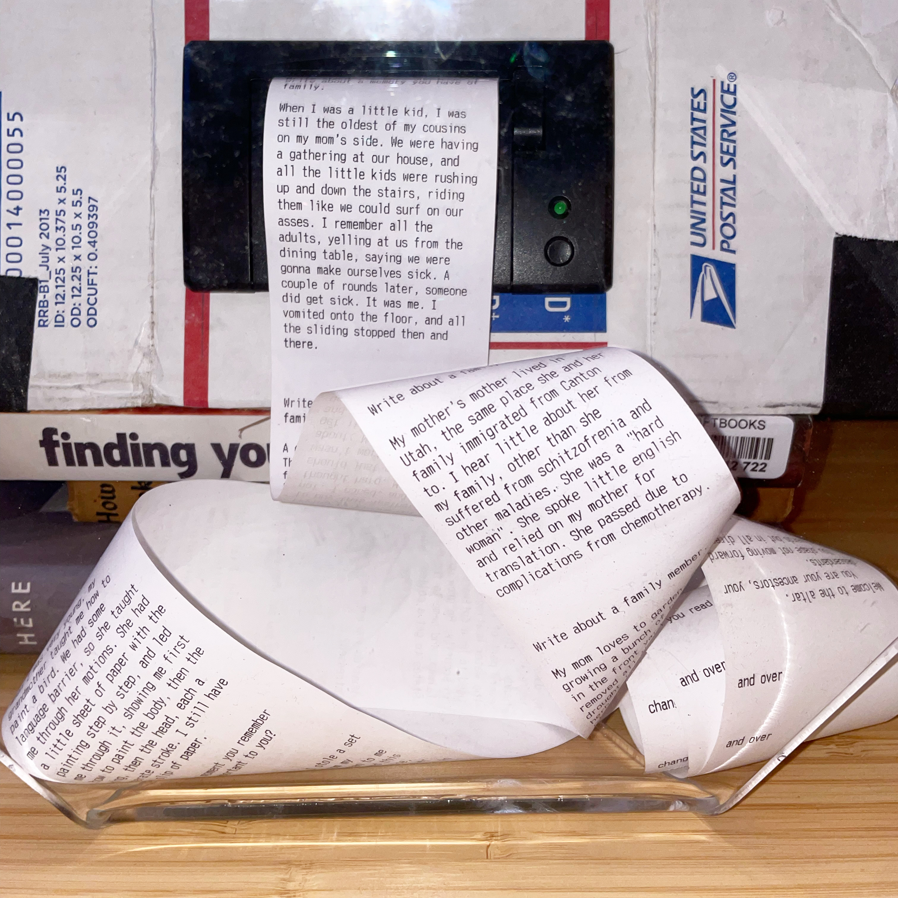

## Class Feedback

- Having a talking altar feels simultaneously comforting and cold.
- Having this live on a Raspberry Pi (versus a full laptop, or computer) adds to the concept as a single-purpose piece.
- Taking in the notes is one thing, but it feels like they should be printed out.

---

## Where I’m Headed

Much of my work here was getting this “altar” to work with **me**, before working with other people. Still resting on ritual and reflection, I got my hands on a receipt printer, a raspberry pi, and a screen. From there, I built myself … an altar? 

Rough, but works. For two weeks I sat in front of this altar every morning and evening, and reflecting upon and answering questions. This helped me hone in the chat-bot part of the piece, narrowing the number of questions down to one, and confirming that I wanted the piece to be always-on, ready to be woken and talked to. 

I also took the chance to test the different ways of housing the prints, letting them pool behind glass, or crowd up into a glass dome. I ended up going with what was simplest, and allowed me to actually reach in and pull the paper to read; just letting it fall from the printer naturally.

### User testing

With the form converging, I have some goals with user testing: 

- I need to test this “altar” or chatbot with other people. Making it work for me is one thing, but there’s something stale about the only input being my own. I can start this work by incorporating some of the quotes I’ve begun to pull from my interviews, but that seems like a supplementary thing, not a main avenue for this project.
- Hanging the stories is interesting, but what happens afterwards? I want to do something ritual-focused or honoring of these stories once they’re printed. Ideally I’m hanging them, but where? And how?
- Do people show interest in the words written by others? Will they read sheets of paper hung from a wall?
- Right now, the setup requires me to kneel in front of the altar in order to engage. This is probably an accessibility issue, but it’s also feeling important because kneeling is a ritual and reverent action. Does a kneeling altar work for more than just me?

The plan: 

Run an in-person user test in the media commons. Set up a kneeling altar, with hung receipts behind it. Invite our friends and faculty to come and try it out. Observe whether kneeling is a barrier, whether people step up and interact with either the printers or the printed stories.