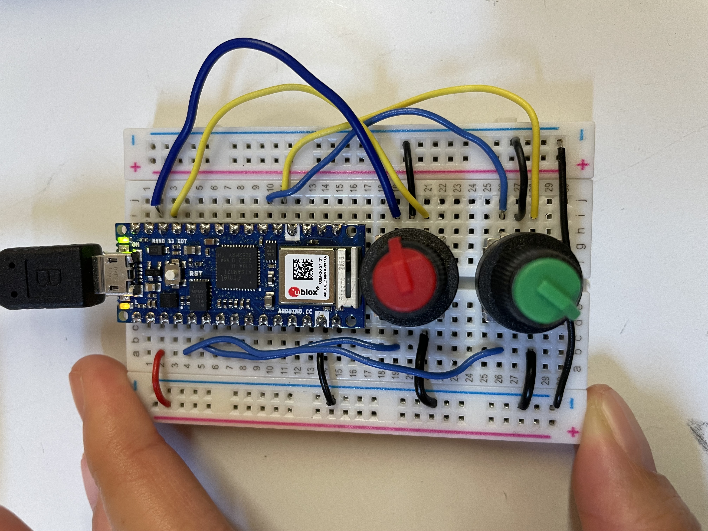
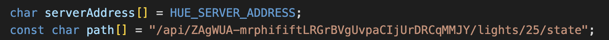
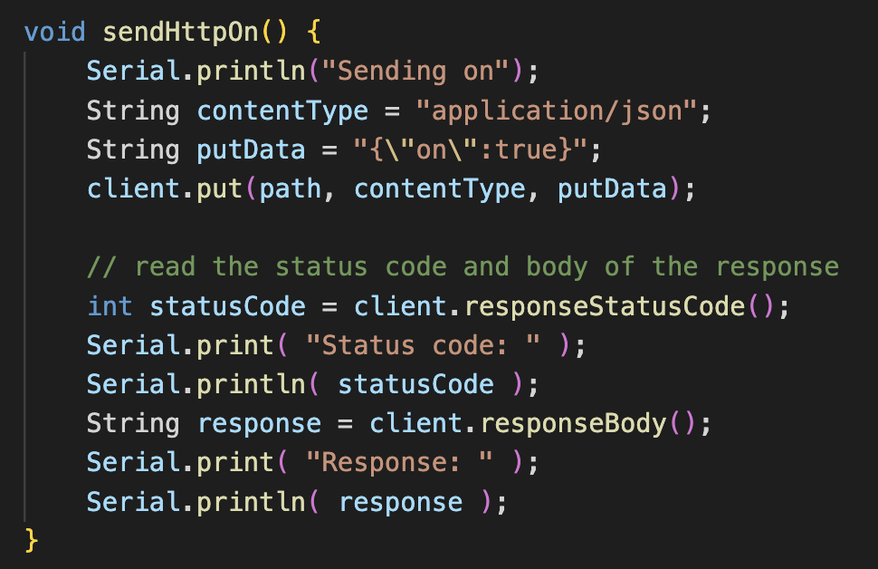
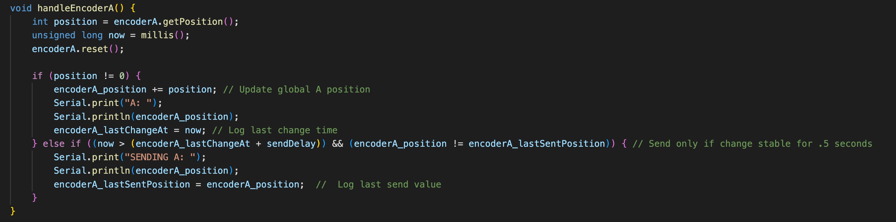

Requirements: 

- Control a Hue bulb/lamp (check!)
- Allow for on/off, and adjustment. (oops)

https://youtube.com/watch?v=Vkv7ah0Aj7U

I’ve used MaxMSP before in other projects, so I thought I’d give it a try first. The setup is pretty simple, but here’s the thing. 

ITS BORING. 

I just find virtual interfaces so un-satisfying to map.  I started to tweak the Max file, but found myself just … unsatisfied with the controls that I was finding. Quickly uninspired by Max, I moved to trying out Arduino. 

---

Things I got working pretty quickly: 

- Flagging changes only after values stop moving
- Reading two rotary encoders at once
- Connecting to Sandbox370
- Creating a client

Things I had an issue with: 

When trying to send a put request to turn my lamp on or off, I kept getting a 501. 

I can’t find the issue; at first I thought I was sending `"true"` , but that ended up being fine. 

What actually turned out to be the issue was I’d used a `port` setting. I’ve not worked much with HTTP requests on Arduino before, so I was used to setting a port. However, this sent my requests to a port on the Hue Hub that entirely derailed my requests. 

After getting rid of that port, I got each rotary encoder button to send a request; one off, one on. 

Here’s the setup: 

After struggling with this for a while, Lifei pointed out to me that Tom actually had an example for Arduino available in the repo, which I'd somehow entirely forgotten about. I felt very silly, looked at the code, and then re-used Tom's send requests. 

https://youtube.com/watch?v=QGU7NB-92Hs

Honestly a lot of this week was not thinking clearly, not referencing the available examples, and then spending way too much time trying to figure things out on my own. It may have been a more successful week if I’d stuck with MaxMSP rather than switching out halfway.

The one thing that I *am* proud of is my code for only "sending" data after the encoder stops moving. 

At this point, it is 11pm on Tuesday and I feel silly. I hope to play around with this a bit more, and actually build a controller I like. Maybe if I have time before class. 

What do I want for this future controller?

- 1 Rotary encoder mapped to brightness
- 1 Rotary encoder mapped to warmth

[Anyway the code I wrote is here.](https://github.com/leils/itp_spr_2023/blob/main/light/06_ard_hue_control/06_ard_hue_control.ino)

## Update: 
I got brightness control to work!!!! Whoo 

https://youtube.com/watch?v=mdwIrtfADEQ

---

Resources used: 

- [https://forum.arduino.cc/t/how-to-post-json-data-from-nano-33-iot/889339](https://forum.arduino.cc/t/how-to-post-json-data-from-nano-33-iot/889339)  (when I didn’t realize there was an example for Arduino code already included in Tom’s repo)
- [Tom's Arduino example](https://github.com/tigoe/hue-control/blob/main/ArduinoExamples/ArduinoHueColorWithEncoder/ArduinoHueColorWithEncoder.ino) for hue control with color