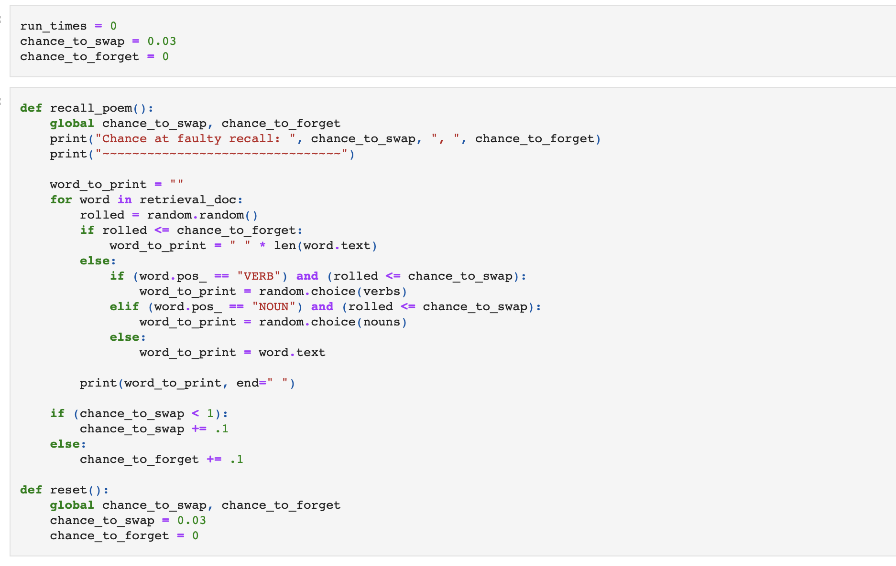

This is a poem that forgets itself every time you try to remember it. 
Written about retrieval-induced distortion, this poem reflects the idea that each time you access a memory, you forget a little part of it. 
Memories are constantly being re-written. The more you remember one, the more you've changed it. Eventially, the memory is nothing like what it started as. 

Below is a video of one full run of this poem. Each time it is reloaded, it either swaps words or forgets them entirely, until all that is left is a blank page. 

https://youtu.be/g0GKooU_wUk

---
## Process 

> The digital cut-up revisited. In assignment #2, the tools available to you for cutting up and rearranging texts relied only on information present in the character data itself. Since then, we’ve learned several methods for incorporating outside information concerning syntax (i.e. with spaCy) and semantics (i.e., word vectors) into what we “know” about a text in question. Adapt your original digital cut-up assignment, making use of one of these new sources of information. What new aesthetic possibilities are made available if the unit of the cut-up can be a type of syntactic unit (instead of words, lines, characters), and if stretches of text can be algorithmically selected not at random, but based on their meaning?

Starting with the poem I wrote last summer, Retrieval-induced distortion.

```
Retrieval-induced distortion;
a phenomena in memory 
where a memory, sweet or sour, 
changes as you remember it. 

When you trace the line of your memories
Tug the string, pull them from the ether
lay them out on the deck 
and they mutate, stretched thin by your tugging 
smudged with your fingerprints 

I remember a day as a toddler
a wood-burning stove, warming the house
and a frozen winter beyond glass sliding doors. 
only this memory reads 
back and forth 
from a VHS tape. 
```

Because the original poem was written to reflect how our recalling of memories can change them, I wanted to emulate that again here. My goal: to chance the poem more and more, each time you "recall" it. I want to do this in a way that still is plausible (ie. doesn't just look like a randomizer was set upon all the words with no regard to the meaning).

My idea:re-writing each line so that it's less and less accurate each run, like every time it's read we're moving the meaning further and further away

Basically, I'm attempting to:

- use spacy to understand what a word is (noun, verb, etc)
- Replace words with other words of their ilk (noun/verb/etc)
- Do this more and more across runs.


Questions that I think affect the concept of the piece:
- Do I rewrite the original file across runs? Or the original "loaded" file? <--- (I chose not to do this for repeatability's sake)
- Do I add a small chance of removing words? <--- (I did this)



```
Chance at faulty recall:  1.03 ,  0.30000000000000004
~~~~~~~~~~~~~~~~~~~~~~~~~~~~~~~~
          -                      
 a string in line           memory   sweet or sour             as you             . 

 When     burning the phenomena of your changes 
     the deck   remember them from           
 reads          on     string 
     they        , smudged thin by      deck   sliding with your changes               a     as a memory 
   phenomena -         wood           the fingerprints 
 and a frozen doors beyond doors trace       .   only this              
      and forth 
 from a     distortion . 
 ```


I really, really liked this. These are really beautiful to me, and I love that they remix the internal contents of the poem. Because I'm swapping nouns with nouns and verbs with verbs, the poem still tends to make sense, until it very much so does not. In the end, there is nothing left of the poem.

Video of the full run: 

https://youtu.be/g0GKooU_wUk

---

What would I like to do with this in the future?

This program does not actively destroy the original text, only its copy in memory. I like that, but I think it would be interesting to play with destroying the original text as well.
I wanted to swap the nouns and verbs with others from the Corpora project, but after looking at the JSON file, I felt unsatisfied with that word bank. I think I'd like to give this another word bank at some point.
I wonder what it might look like to "mix" memories through mixing poems.

[Jupyter Notebook](https://github.com/leils/itp_spr_2023/blob/main/rwet/HW%2004.ipynb)