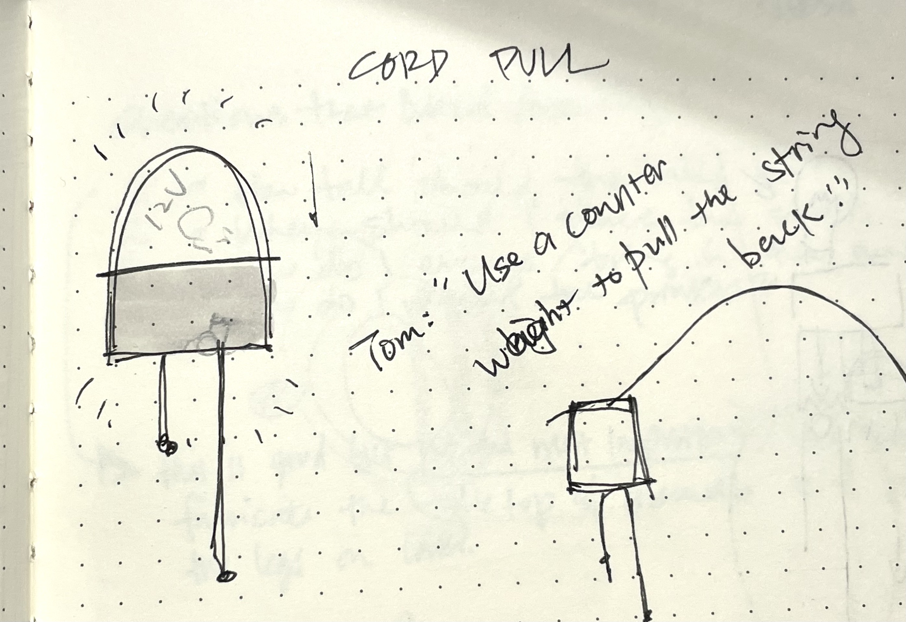

Shuang and I brainstormed a lot this week, and have settled on a project that may be a bit of a stretch. We’ve decided to tackle the task of reading before bed; we want to make a light that is both a reading lamp and a timer to sleep. 

Mounted above the head of the bed, this lamp is turned on about 20 minutes before you want to sleep. The lamp is actually two lights: one upwards-facing light that reflects off the wall it’s mounted on to give the room an ambient glow, and one downwards-facing light to point at the book that you are reading. The room light starts off bright, and over the next 20 minutes, dims, giving you a gentle ease into bedtime. The bottom light illuminates your reading, and turns off at the end of the 20 minutes. 

Things that we’re still figuring out about the lighting: 

- How do we provide a “warning” for the reading lamp turning off? Is dimming the room to black enough?
- We are looking at a warmer light for the up-lamp and a cooler for the low one. While one of the research papers we read said that this was good for focus, we wonder if that’s the same for relaxation before bed?

---

Here’s the reach part: the interaction we’d love to have is a weighted pull-cord, that hangs out from under the clock reminiscent of an old grandfather clock. In the grandfather clock, you would pull the weight down to wind the clock. In our lamp, we want the cord to slowly wind back across those 20 minutes, being a physical representation of the time passing. 

We’ll spend the next week testing this cord/belt setup, and if that doesn’t work go back to the drawing board on interface. 

---

Extremely estimated and probably inaccurate BOM: 
| Component | Cost |
| --- | --- |
| Light Components  | ~ $40  |
| Acrylic (Translucent White) for Diffusers  | ~ $30 |
| Plywood for Body  | ~ $30 |
| Electronics (Arduino, Rotary Encoder, Power etc)  | ~ $50  |
| Gears and Timing Belt  | ~ $25 |

---

(As a side note, the 12v control I made a while back came very much in handy while we tested various lights from Amazon! I've migrated it into [a nice stable box](https://www.instagram.com/p/Co3cTjyNDf8/?utm_source=ig_web_copy_link), and I'm very pleased with how sturdy and helpful it's been.)

