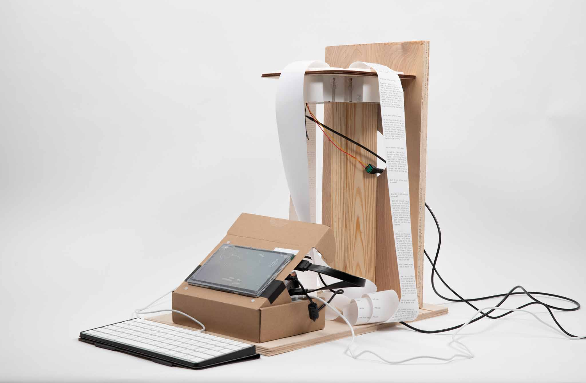
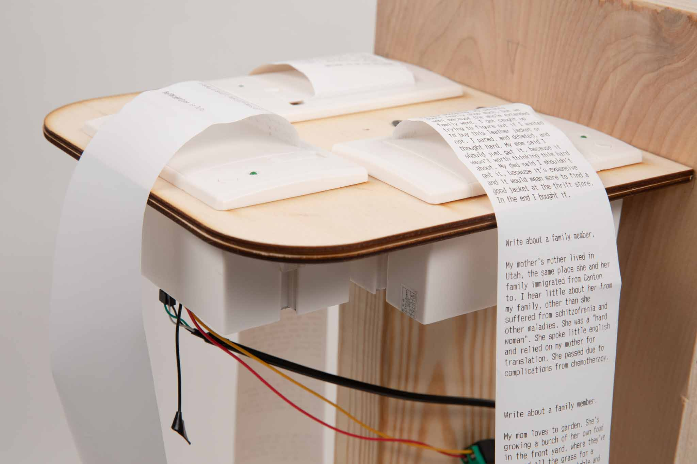
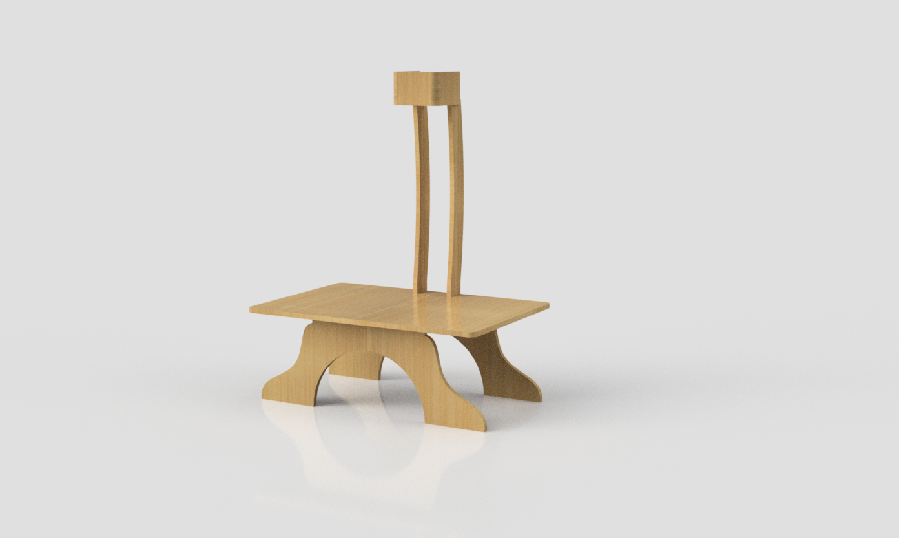
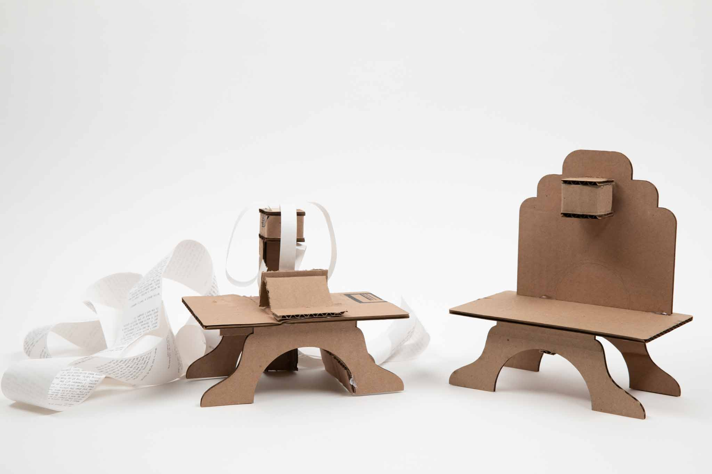
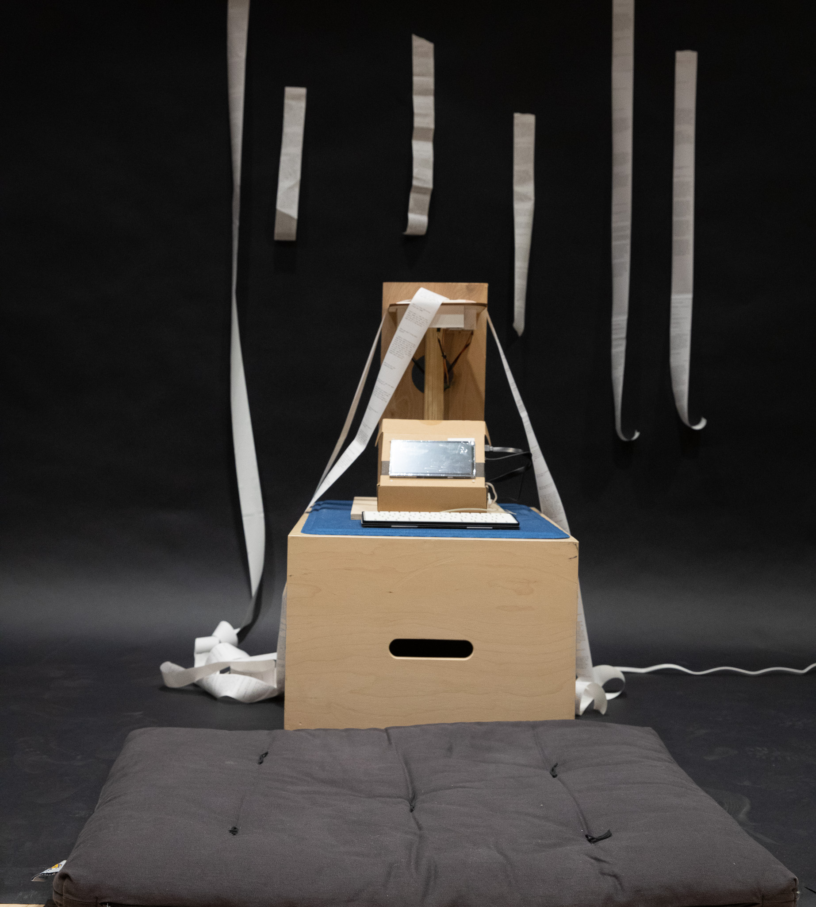
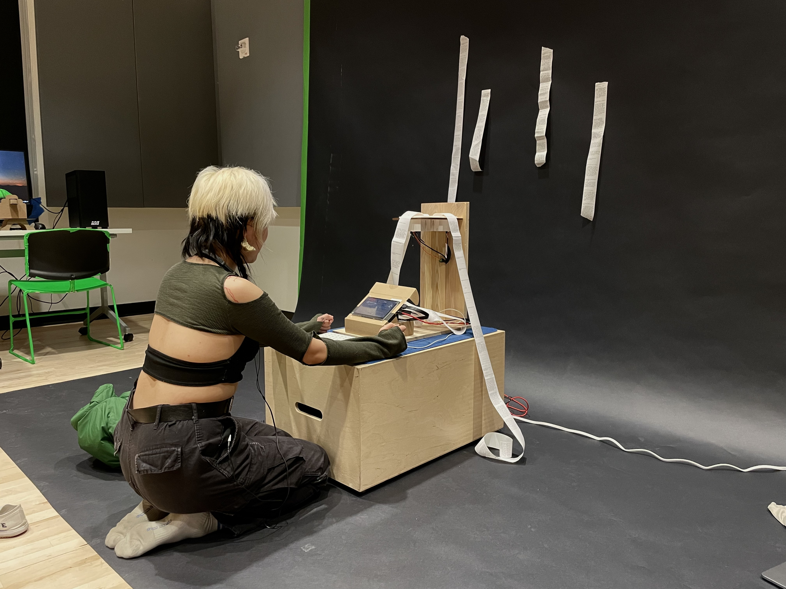
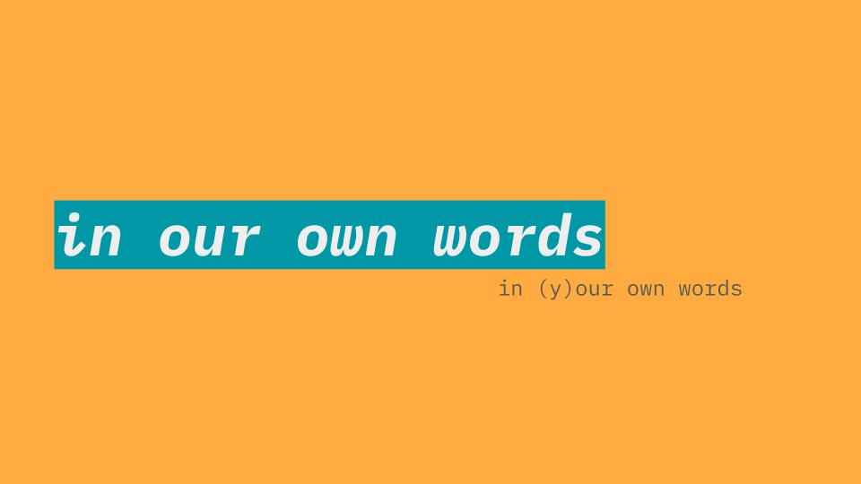

## Altar V2

After I figured out the direction of my altar with my cardboard prototype, I started two new avenues of prototyping: functionality, and form. 

### Functionality

I knew I wanted to be running multiple thermal printers at once, and printing different things to them all. I made an order for 3 more printers, and set about making a function prototype. 

This prototype includes all the goodies of my previous setup (a Raspberry Pi, a screen, a keyboard) but gains two extra printers. I followed a “1 day to proof of concept” approach here, essentially kicking this together in a single day as soon as I had the necessary parts. 

This was built to test basically three things: 

1. How to direct attention from looking down at a screen to looking up at a series of printers 
2. Where to place the printers in comparison to the console 
3. Whether the printers would “cascade” or “pool” the way I’d imagined 

### Form

At the same time, I started designing a form for this altar in Fusion360. I then laser-cut these altars at a smaller scale to see how they would register in real life. The laser-cut versions helped tremendously, even if they were only a few inches tall. 

---

## User Test

Julia and I set up in the media commons for an in-person user test. Here, a lot of things felt like they were going wrong, but they ended up giving me a lot of great feedback. Much thanks to everyone who stopped by during the feedback session. 

https://media.giphy.com/media/bFLnJdCfaC7VzmgdKn/giphy.gif

### Feedback

- Scroll/printout placement is SUPER important. When it’s behind the altar and seemingly on a space you may not want to touch, people will not engage with them.
- Receipt printers definitely mean folks want to tear the scrolls. The dotted lines I created to try and delineate the different stories? They look like tear indicators!
- People have a desire to answer more than one question. Right now the have to go back through the entire experience to answer another question, which can get frustrating.
- Kneeling is definitely an accessibility issue.
- The prompts can get a little long, I need to re-work that script.
- The connection between the question you respond to and the two other printouts is not yet clear.
- There’s a chance for the chatbot/altar to have a bit more of a persona. How can it guide your experience? How can it be a reflection or mirror of me?

---

## And A Presentation Too

.jpg)

I also have been working on a presentation! This is what I tested with my online feedback sessions with alumni. 

The general feedback: 

- I’m pretty well set up for my presentation. The story is clear and compelling, and my cadence is not too rushed.
- The main missing thing is a conclusion … a wrap-up, or maybe a quote to leave the audience with.
- I have a chance to do something clever with the words, if I so desire.

Overall I’m not too worried about the presentation, but I might spend some extra time figuring out some clever ways of incorporating my actual project into the presentation format.