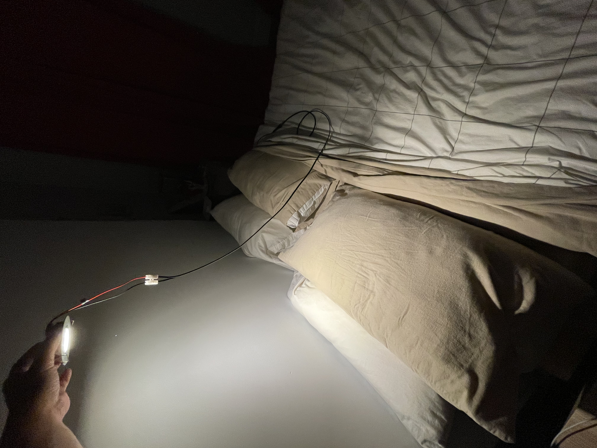
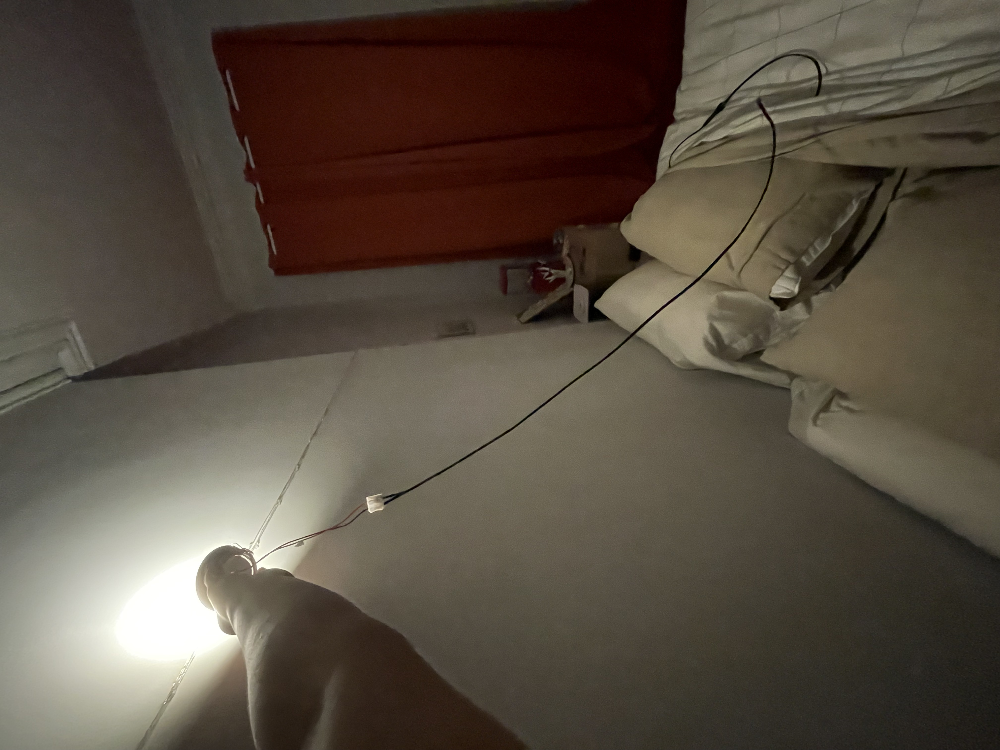
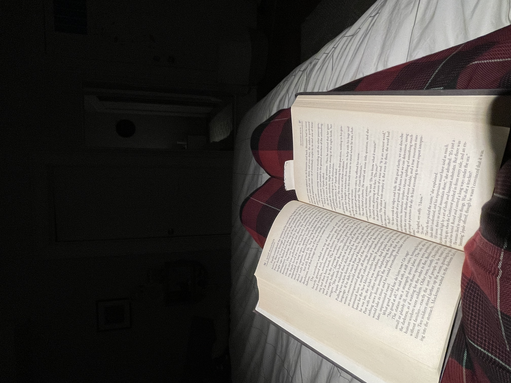
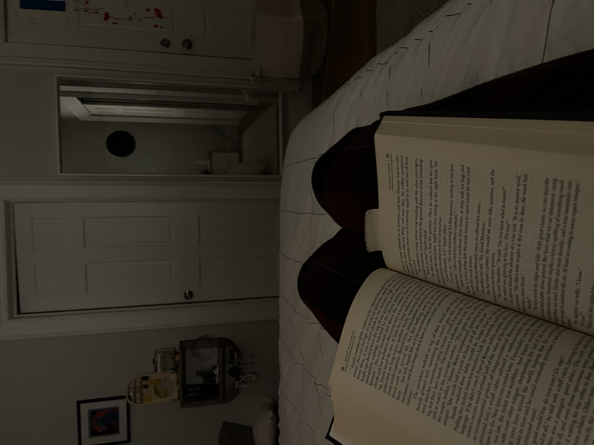
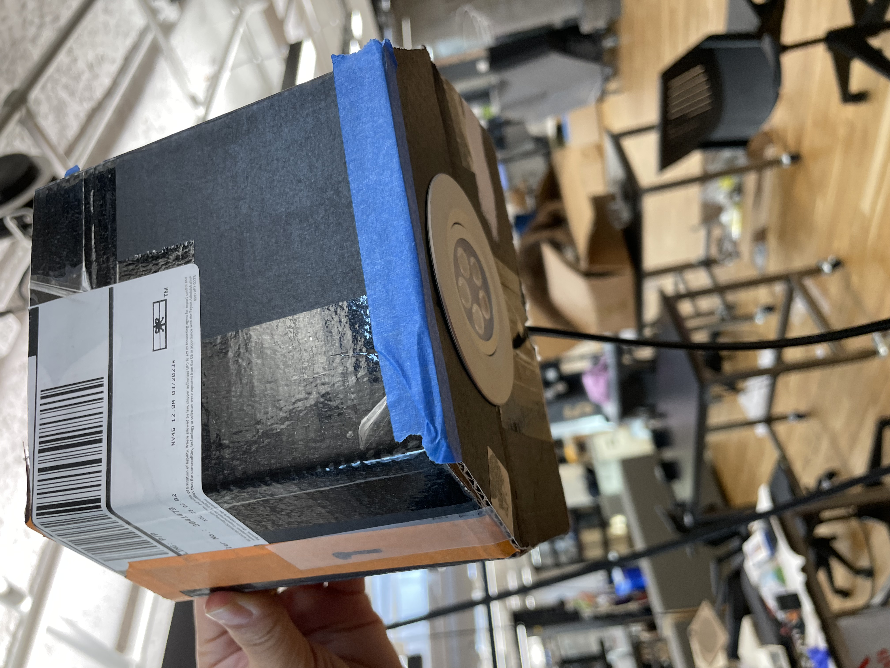
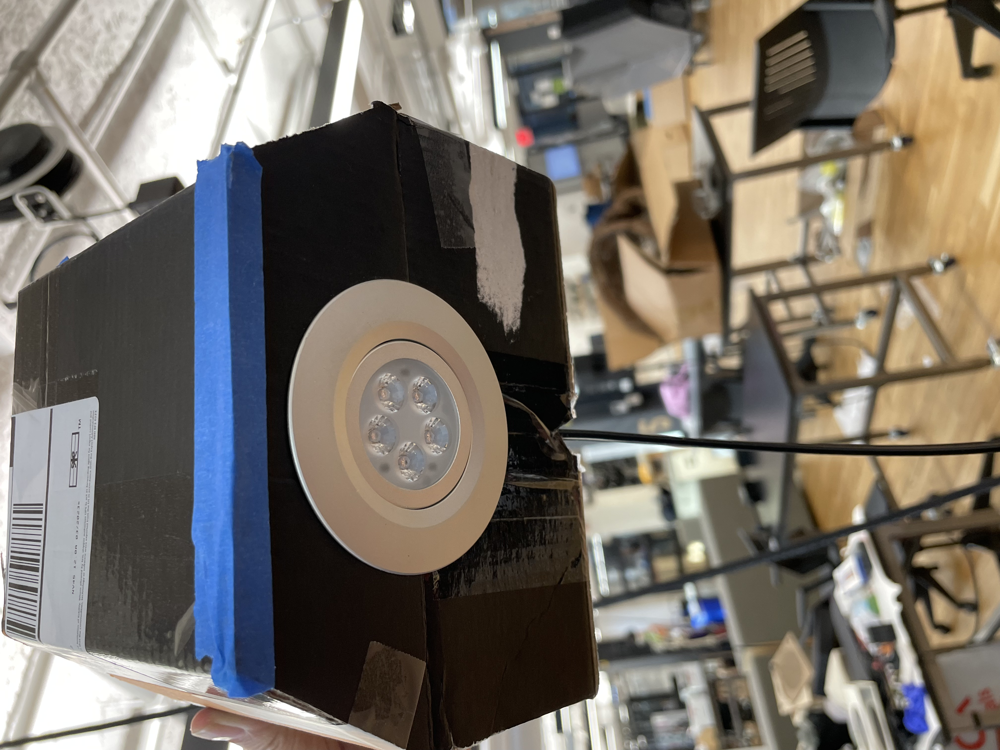
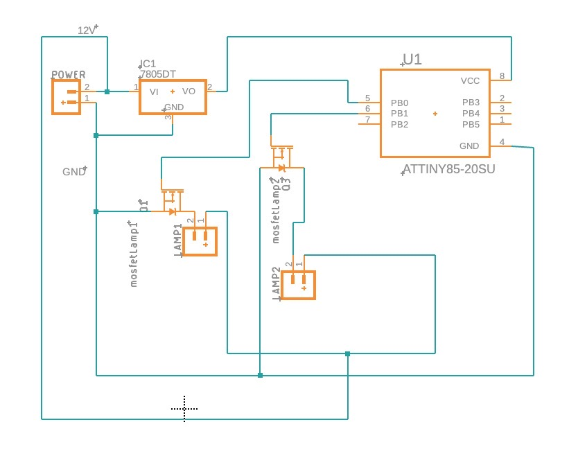
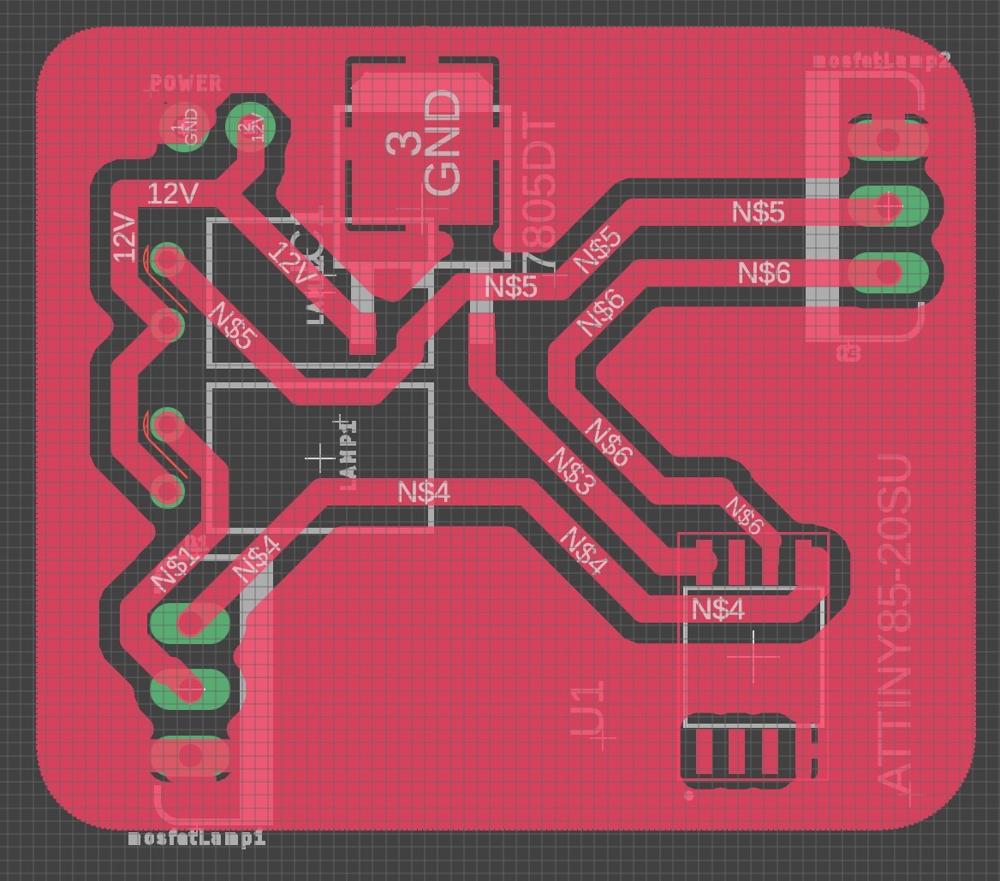

This week, I tested the lights we purchased in my home, pointing them up towards the ceiling and down onto an open book. 

The open book reflected 25-27 lux (measured from where my eyes were, reading), which is within the recommended amount of light for reading. 
Cast upwards, the entire room does light dimly, which is nice. The back wall of my room is not pure white, which is something to consider. 

Tested the installation of the puck light: 

Shuang started working on the electronics, hooking up a circuit and designing a PCB for the ATTiny. 

