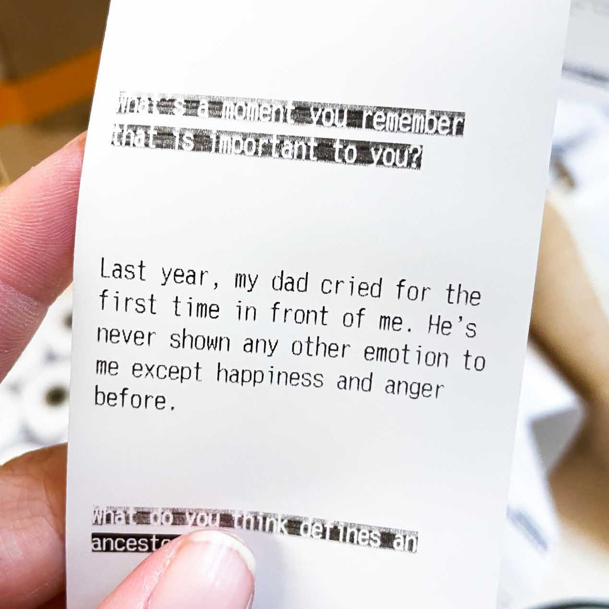
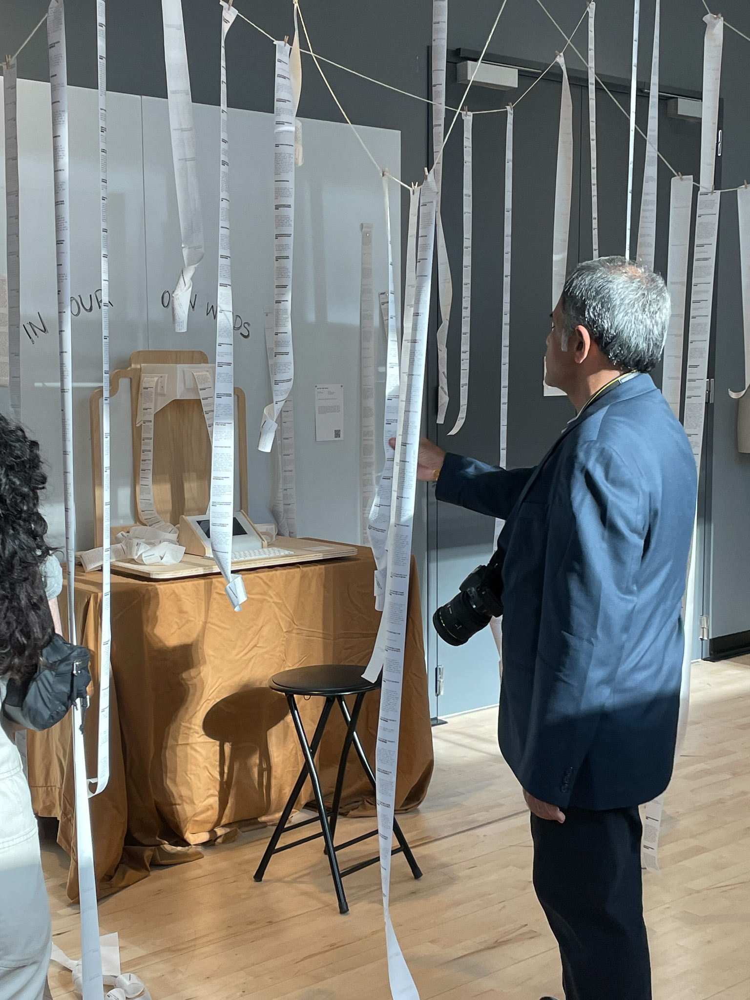
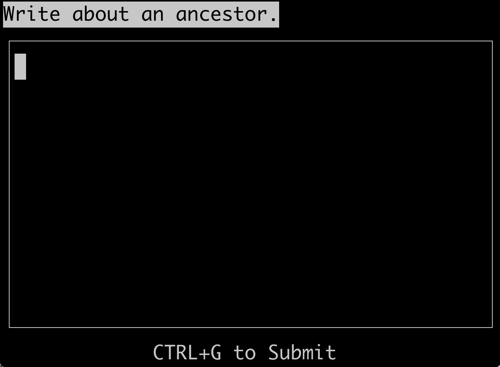
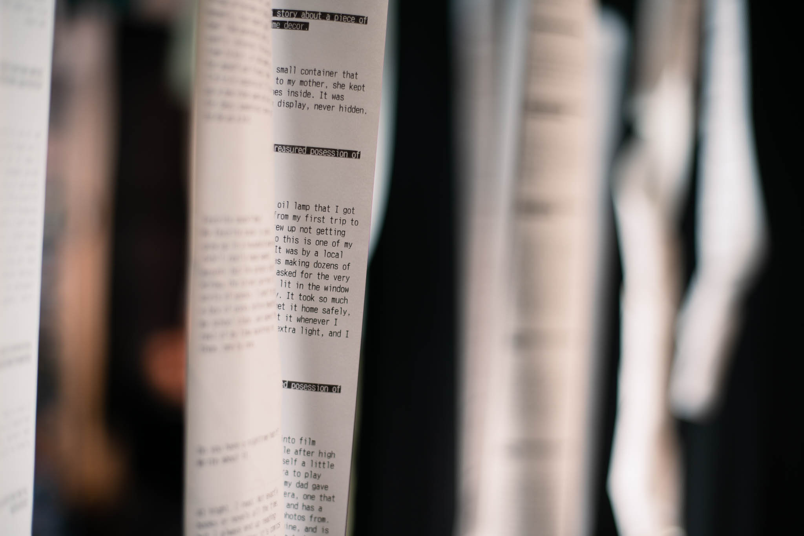
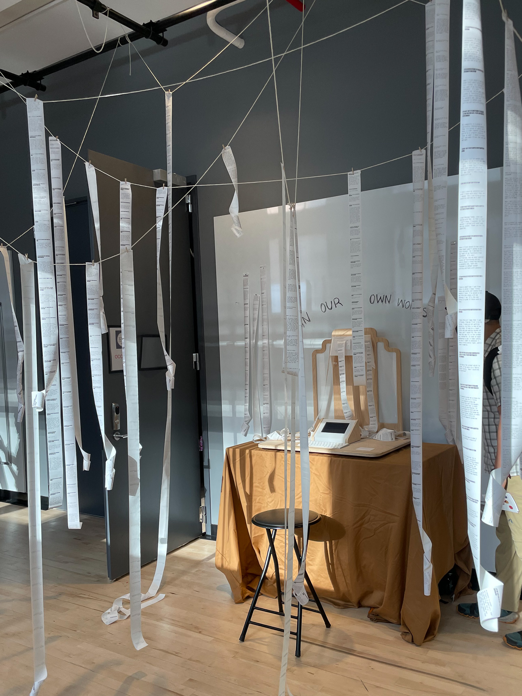
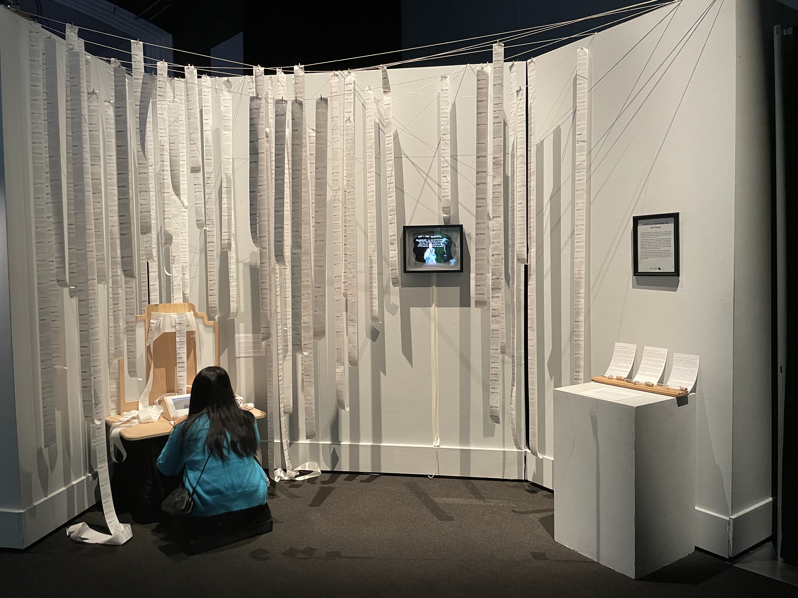

https://vimeo.com/826379955 

In Our Own Words is about the stories that make us who we are, and finding ways of sharing them. Part altar and part confessional, it was originally built as a tool to help me process and understand parts of myself. Now, it's an altar for everyone and an archive of the people that have visited it. By sharing personal stories, we give people a window into our shared identities, building empathy and understanding through printed words. 

In Our Own Words is a set of questions. 

In Our Own Words is an archive of answers. 

In Our Own Words is an altar with a screen and a keyboard. 

In Our Own Words is a forest of messages, of words, of questions, and most of all, of stories. 

When you sit at the altar it will ask you a question, showing you the responses from other people that have visited before you. Share your own story, and your words will be added to the archive, to be read and witnessed by others. The altar is surrounded by and lives within this archive. In order to reach the altar, you pass through the stories first. I believe that our identities are built of all parts of us, big and small. From the details (the way you take your coffee, whether you make your bed) to the bigger things (formative childhood memories), these moments accumulate into the person that you are today. They shape the choices you make and become the stories you tell yourself about who you choose to be. In Our Own Words was built to treat these stories with tenderness, holding them in the open for everyone to see. When you read the stories, I hope you think about the people who wrote them.

---

In Our Own Words has been showcased at [After the Imagination](https://www.instagram.com/p/CqMdQHeNFD9/) (Apr. 2023), The [ITP/IMA 2023 Spring Show](https://itp.nyu.edu/shows/spring2023/) (May 2023), [Words to Remember By](https://leiac.me/content/2024/2024-01-01_Words-to-Remember-By/)(July 2023),  (Sept 2023), the [Gray Area Artist Showcase](https://grayarea.org/event/gray-area-artist-showcase-and-member-happy-hour/) (Dec 2023), and the [tiat seminal show](https://www.tiat.place/exhibitions) (Nov 2025).

https://youtu.be/uRzqG3wk5_4

## Technical Overview

The altar presents you not only with a question, but two responses to that question left by other people. These are all surfaced on three thermal printers mounted to the head of the altar. In this way the altar is not only the input but also the tool that creates the archive. It juxtaposes your words with everyone else’s, asking you to consider them together. The stories are printed on thermal paper each time a story is added to the archive. The length of the paper is a reflection of the number of people that have visited the altar, and as the scrolls grow they pool around the base of the altar. Eventually, I cut and hang in the “forest” by hand. The altar lives mostly on a Raspberry Pi 3+, hidden behind the tabletop screen. 

The altar’s program is written entirely in Python, created to always be on and and ready to be awakened as long as the altar is powered. This Raspberry Pi is connected to the three thermal printers via usb-to-serial convertors, with all the wiring routed in hidden channels under and behind the altar. The altar housing itself is made out of CNC-milled plywood and laser-cut and bent acrylic, all designed in Fusion360. In the case of future exhibitions, the it is designed to be disassembled and easily transportable.