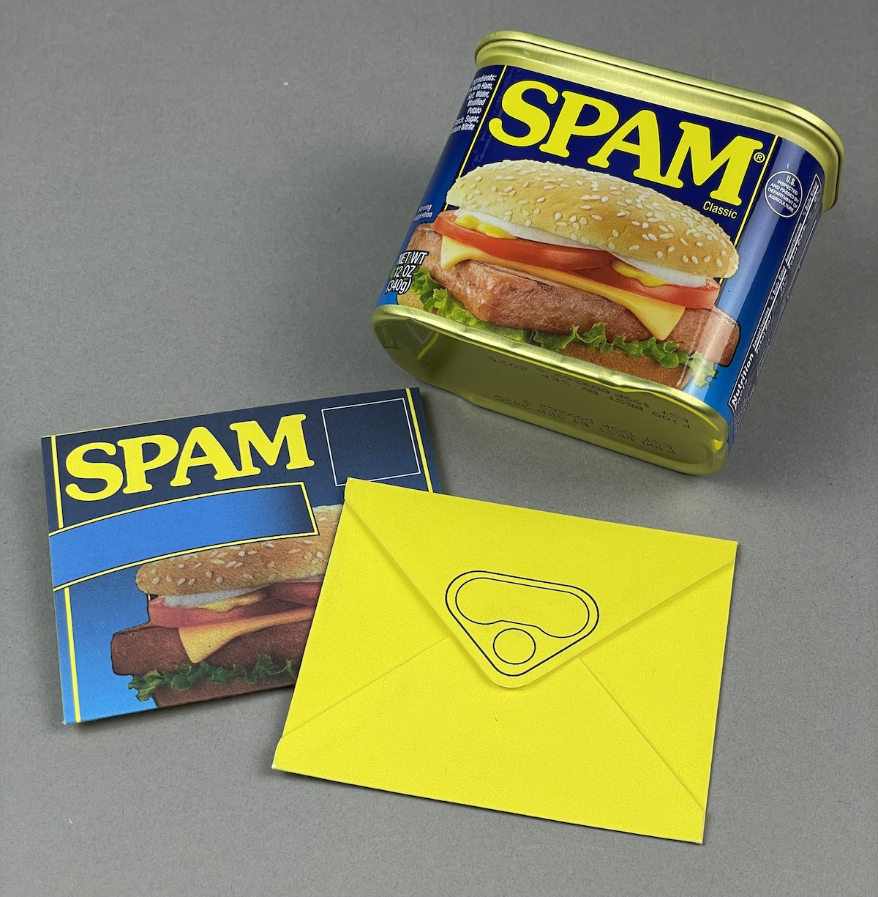
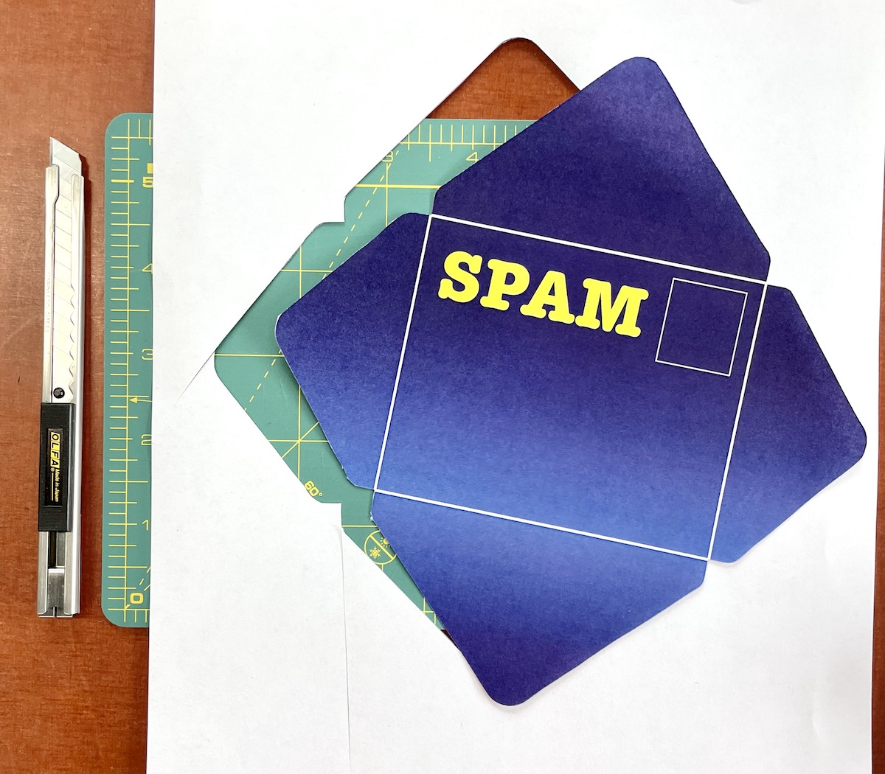

SpamMail was a small project created for SPAMtember, a week-long hackathon run by my good friend Shuang Cai. 

SpamMail is a mashup of the SPAM brand and the concept of spam mail, resulting in a cute piece of stationary that allows you to send Spam to your friend through the physical mail. 

