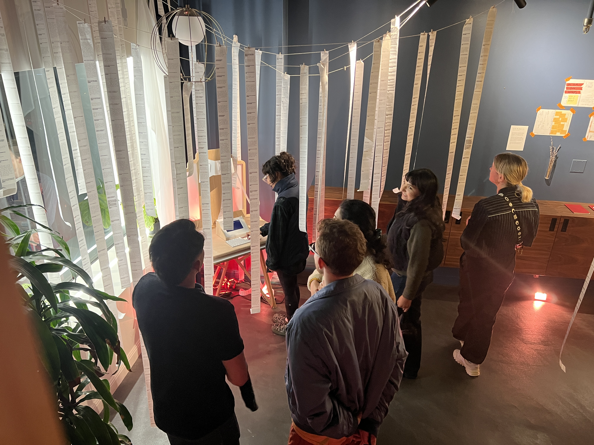
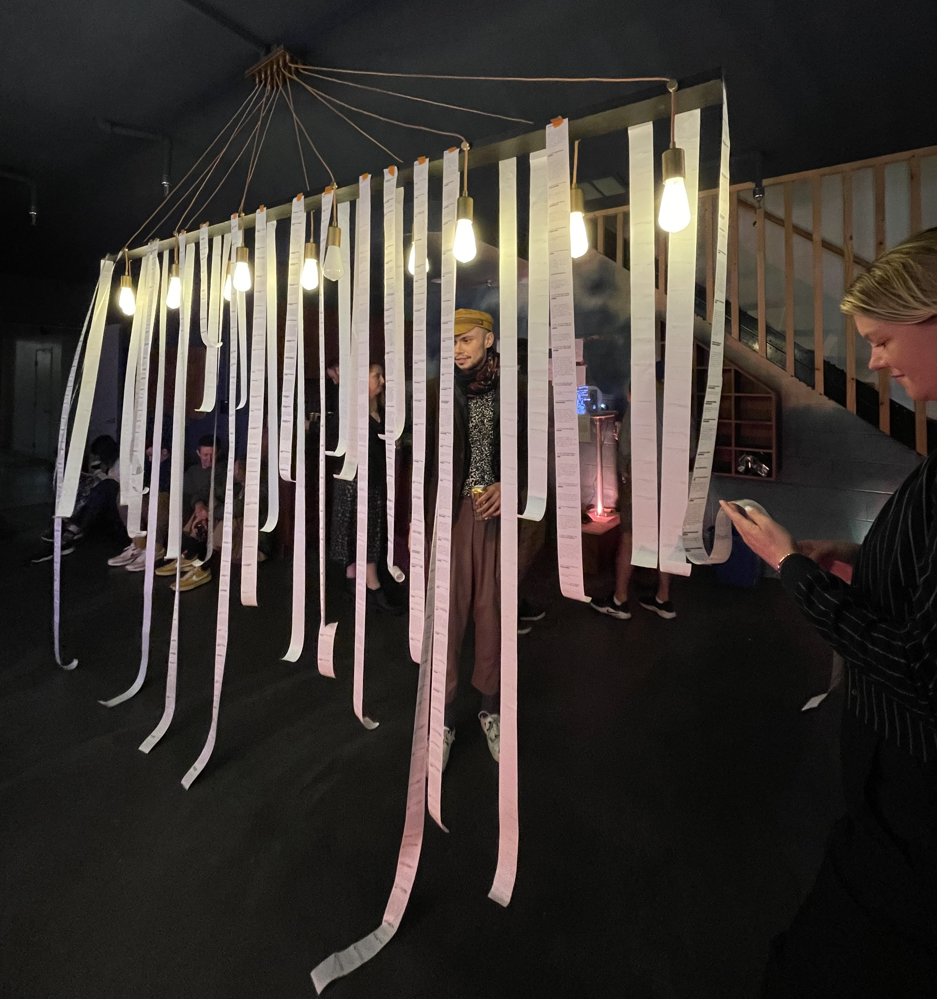
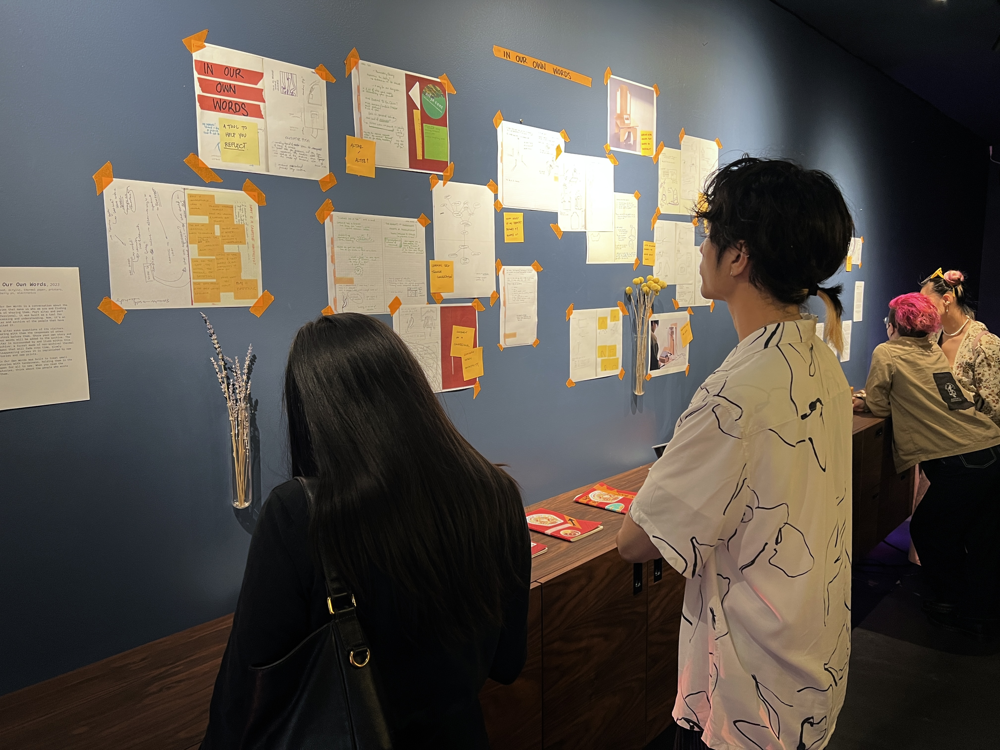
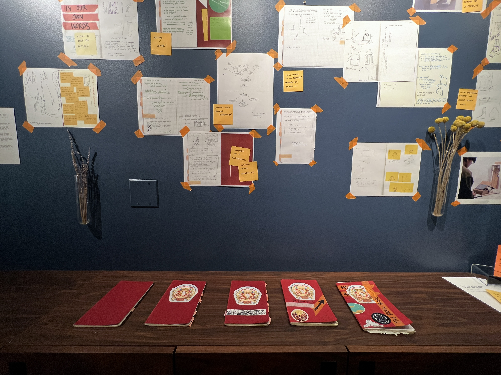

Words to Remember By was a solo show consisting of three works, connected by the narrative of memory, identity, and storytelling. This show was on view at Studio 45 from 9.9.23-10.11.23 (then entitled *mid conversation*), and a condensed version was shown at the Gray Area Incubator Showcase 12.13.23-12.14.23. 

This series includes the following pieces: 
- [In Our Own Words](https://www.leiac.me/content/2023/2023-05-04_in-our-own-words/) 
- [What I Can Remember](https://www.leiac.me/content/2022/2022-12-17_what-i-can-remember/)
- [What Identities Do You Choose To Wear](https://www.leiac.me/content/2022/2022-12-09_what-identities-do-you-wear/)

This set of works brings the viewer into my own stories through static images, writing, and objects from my life. After their introduction, the viewer is invited to share their own stories with future audiences through an interactive altar. 

In its initial showing, the exhibition also included behind-the-scenes work, including sketches and ideation of the works on display. 

