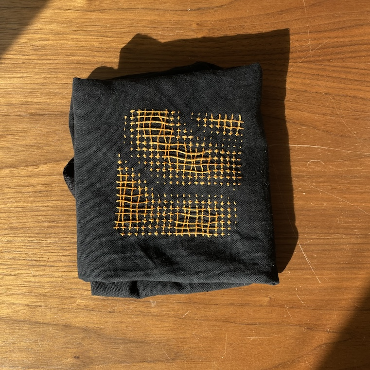
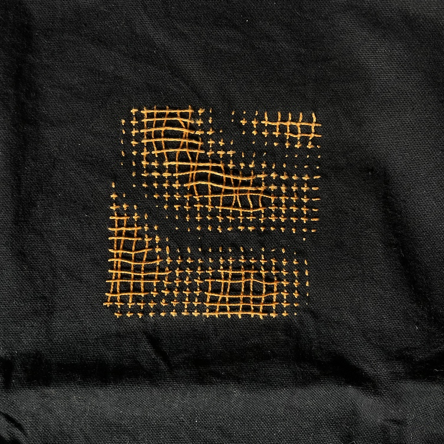
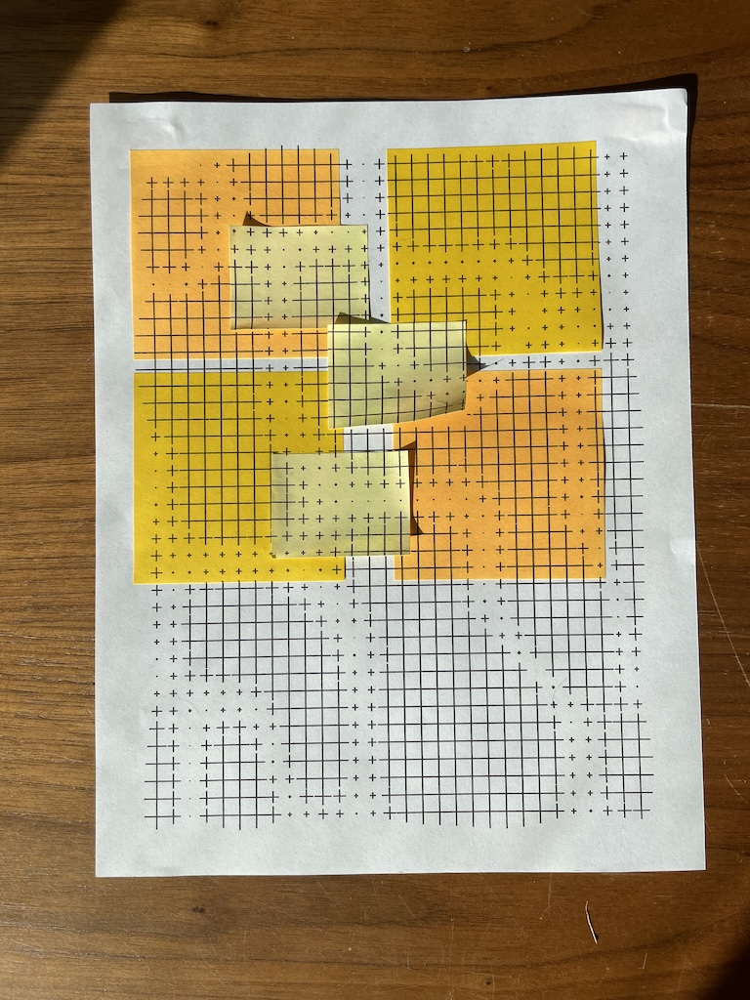
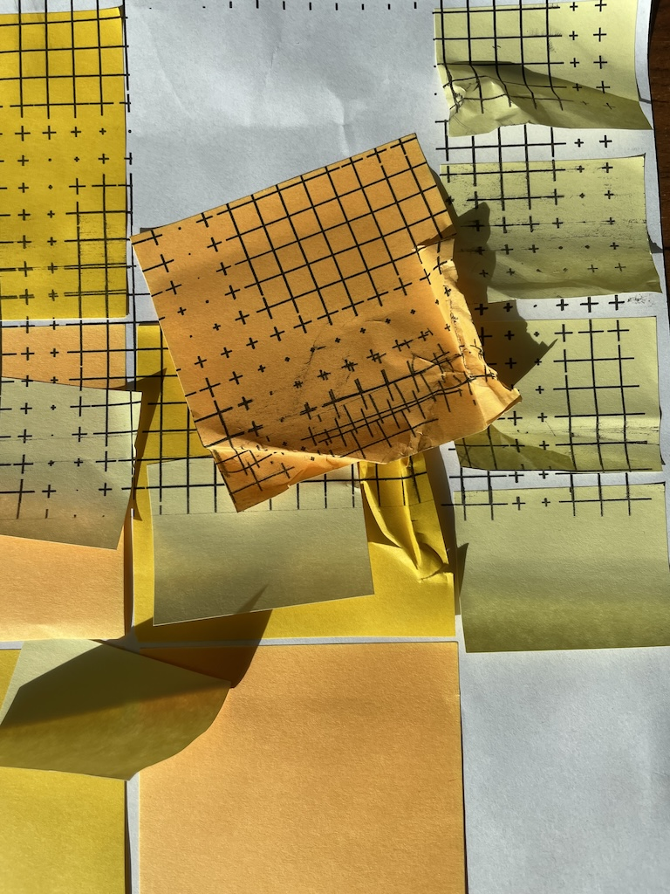
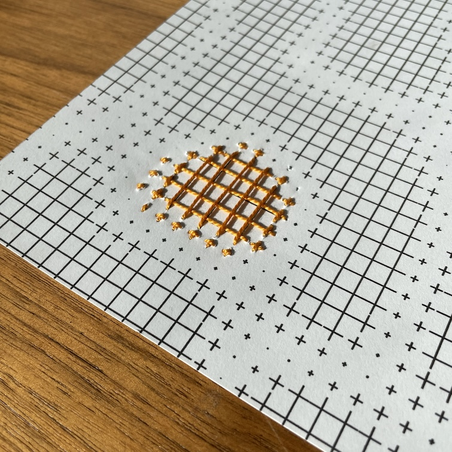

A series of experiments with a code-generated grid pattern placed on tangible material. The pattern was generated in [Canvas Sketch by Matt DesLauriers](https://github.com/mattdesl/canvas-sketch?tab=readme-ov-file) (previous experiments with this tool can be [found on Github](https://github.com/leils/canvassketch-genart)). 

