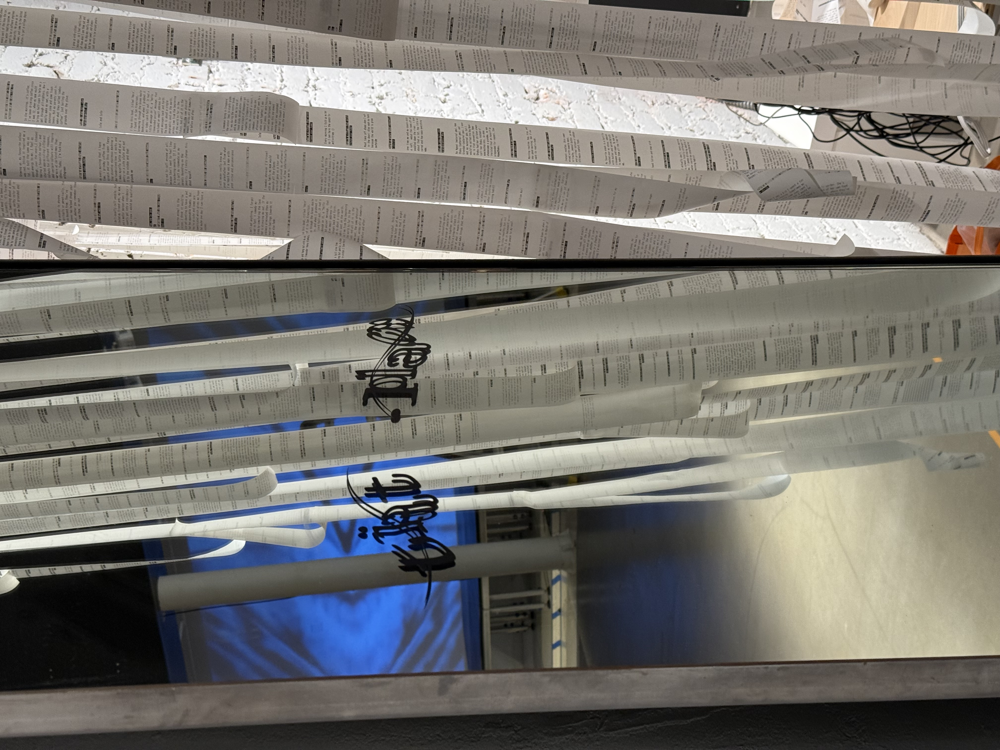
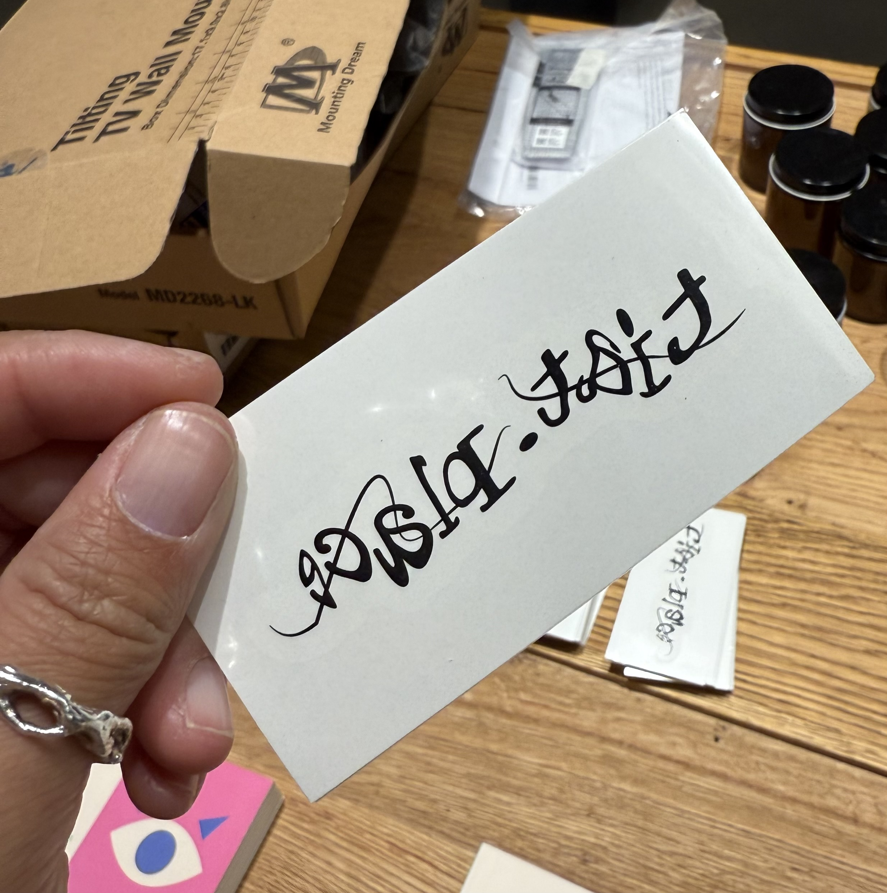
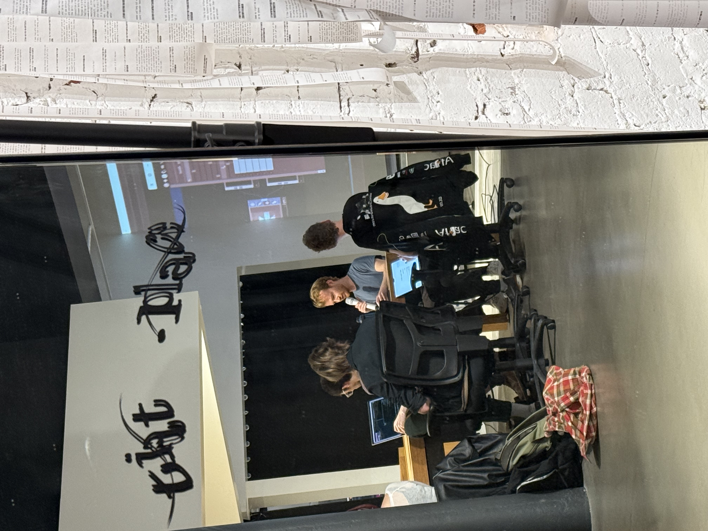

Custom captcha text logos created for [tiat.place](https://www.tiat.place/). I tried to make a few [code tools](https://sites.leiac.me/tools/captcha.html) to generate these, but the result was sub-par; the final versions were created by hand in Illustrator. 

An original captcha image was created for ecah of the 7 large mirrors in the tiat gallery space, designed in Illustrator and cut from adhesive vinyl using a CNC plotter. One image was chosen and used across other brand materials, such as stickers, bags, and temporary tattoos. 

